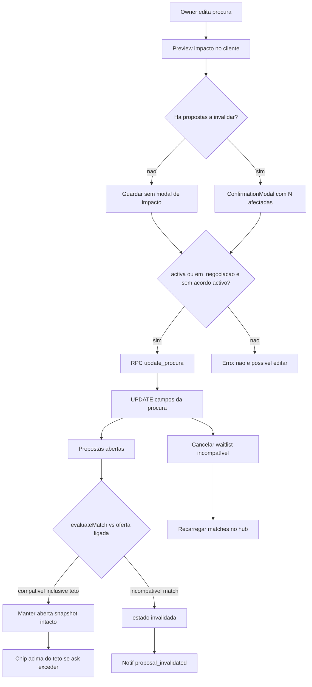

# Editar procura activa (feedback piloto)

## Leitura do feedback

A Maria Elsa criou a procura (Kero Talatona → UnIA, 17:00, teto 25 000 Kz) e pediu para **retificar** um valor alto. O cartão activo só tem **«Ver ofertas compatíveis»**. Não é um bug de matching: é uma lacuna de produto. No piloto, o único workaround seria pedir-nos para apagar dados à mão — inaceitável.

## Auditoria (estado actual)

### 1. Estado da procura

Tabela `procuras` ([supabase/migrations/20260904135648_marketplace_t6_create_oferta_procura_schema.sql](supabase/migrations/20260904135648_marketplace_t6_create_oferta_procura_schema.sql)):

- Estados: `activa` | `em_negociacao` | `fechada` | `cancelada`
- `em_negociacao` existe no chip e no matching, mas **ninguém o escreve**
- Aceite (`accept_proposal`) põe a procura em `fechada` e as irmãs abertas em `cancelada`
- [ProcuraService.js](src/services/ProcuraService.js): só `createProcura` / `createProcuraWithGrupo` / `list` / `get` — **sem update nem cancel**
- Hub em [PassengerDashboard.jsx](src/pages/PassengerDashboard.jsx) (L760–766): um único CTA

### 2. Matching

[MatchingService.findCompatibleOfertas](src/services/MatchingService.js) usa **só** horário, OD, `dias_semana` e `n_candidato`. `**teto_mensal_kz` não entra no matching.** Após um UPDATE da procura, o recálculo no `carregar()` já usa os campos novos — o matching em si não precisa de API nova.

Oferta flexível: alteração só de OD **não** torna a proposta incompatível (`evaluateMatch` ignora OD no flex).

### 3. Propostas

Snapshot já existe na linha `propostas`: `oferta_id`, `modo_preco`, `valor_mensal_ask_kz`, `n_passageiros_propostos` (`N_proposto`). CHECK já inclui `invalidada`, mas [propostaEstado.js](src/utils/propostaEstado.js) **exclui** `invalidada` do histórico («sem writer UI»). P0: sem UPDATE client em `propostas` — só RPC.

### 4. Grupos / membros

`grupos.procura_id` 1:1. `n_candidato` sincroniza-se via [GrupoService.syncNCandidato](src/services/GrupoService.js) (UPDATE client **só** deste campo). Pickup dos membros é independente da OD da procura. **Edição da procura não mexe em grupo, membros, `n_candidato` nem pickups.**

### 5. Notificações

Só `proposal_received` no INSERT. Não há aviso quando uma proposta deixa de ser válida. Deep links em [notificationRouter.js](src/utils/notificationRouter.js).

### 6. RLS / RPC

RLS permite UPDATE/DELETE da procura pelo `owner_id`. Tabelas críticas G11 (`propostas`, `lista_espera`, …) **não** incluem `procuras` — por isso o sync de N continua possível. Invalidar propostas / cancelar waitlist **tem** de ser RPC (invariante 20).

### 7. Quatro N

Edição **não** altera `N_actual` (`n_candidato`) nem `N_proposto`. Proposta antiga permanece snapshot.

### 8. Pricing

Teto é preferência, não preço da proposta. Baixar o teto **não** invalida nem recalcula `valor_mensal_ask_kz`. Adenda / `renegotiate_agreement_pricing` continua a ser o único caminho para mutar preço de acordo.

## Ajustes fechados (pré-Execute)

### Teto abaixo da proposta → manter + «acima do teto»

- A proposta **fica `aberta`**. Snapshot (preço, `N_proposto`, oferta) **intacto**.
- Comparar o teto da procura com o valor resolvido da proposta no **mesmo modo** (`POR_PASSAGEIRO` → quota; `TOTAL_ACORDO` → total). Helper `isPropostaAcimaDoTeto`.
- UI: chip humana **«Acima do teto»** no cartão da proposta (inbox/enviadas). Sem jargon.
- Teto **não** é filtro de matching e **não** dispara invalidação.

### Confirmação por impacto, não por existir proposta

Antes de gravar, o cliente corre o mesmo `evaluateMatch` sobre cada proposta `aberta` + oferta ligada (preview; a RPC continua a ser a fonte de verdade).

- **0 a invalidar** (só teto, só flex+OD, ou tudo ainda compatível) → gravar **sem** modal de impacto.
- **N ≥ 1 a invalidar** → `ConfirmationModal`: «N propostas deixam de corresponder à nova procura. O preço e o número de pessoas em cada uma não mudam; passam ao histórico como incompatíveis.»
- Cancelar/arquivar procura → modal **sempre** (acção destrutiva), com contagem de propostas abertas e waitlist afectadas.

### Notificações claras (invalidar e cancelar)

Dois tipos distintos, copy PT-PT, deep link para o hub da **contraparte** (mesmo padrão `metadata.inbox` que `proposal_received`):

- `proposal_invalidated` — a procura mudou (hora/dias/OD) e esta proposta **já não corresponde**. Destinatário = contraparte. Mensagem do género: «A procura foi actualizada. Esta proposta já não corresponde — o valor negociado não foi alterado.»
- `proposal_cancelled` (ou `procura_cancelada` no metadata) — o dono **arquivou** a procura; propostas abertas passaram a `cancelada`. Mensagem do género: «A procura foi cancelada. Esta proposta ficou sem efeito.»

Waitlist cancelada no arquivo: sem nova notificação de proposta (não há proposta). Sem notificação se a edição não invalidar ninguém.

### Papel de `return_time`

- Existe na coluna e em `createProcura`, **não** está no formulário do hub e **não** entra no matching (só `preferred_time`).
- Nesta feature: **não** adicionar campo de regresso à UI de criar/editar.
- RPC `update_procura` **preserva** `return_time` se o cliente não o enviar — **proibido** anular com `null` por omissão.
- Reservado até haver matching/UI de viagem de regresso. Fora do âmbito de matching e de invalidação.

### Intocado (exactamente como está)

A edição da procura **não** altera `n_candidato`, `n_maximo`, composição do grupo, pickups de membros, nem qualquer campo de snapshot da proposta (`valor_mensal_*`, `n_passageiros_propostos`, `oferta_id`, `modo_preco`).

## Decisões de produto (fechadas)

- **Quem:** só o `owner_id`.
- **Quando:** `estado` ∈ `activa` | `em_negociacao` **e** não existe acordo `activo` / `cancelamento_pendente` nesta procura. `fechada` / `cancelada` → CTA escondido + RPC recusa.
- **Campos editáveis:** `origin_*`, `destination_*`, `preferred_time`, `dias_semana`, `teto_mensal_kz`.
- **`return_time`:** reservado; preservar no UPDATE; sem UI e sem matching nesta feature.
- **Fora:** `n_candidato`, `owner_id`, `n_maximo`, conversão individual↔grupo, composição/pickups.
- **Propostas:** nunca UPDATE de preço / N / oferta. Incompatível de **matching** (horário / dias / OD vs oferta **fixa**) → `invalidada` + notif. Teto baixo → `aberta` + chip «Acima do teto». Flex + só-OD → `aberta`.
- **Arquivar:** RPC `cancel_procura` → procura `cancelada`; propostas `aberta` → `cancelada` + notif distinta; waitlist → `cancelada`.
- **Auditoria:** `updated_at` + transição de estado + as duas notifs. Sem tabela de histórico de campos.
- **Não** usar edição da procura para «corrigir» uma proposta já enviada.

## Abordagem técnica

1. **Spec** em `[.specs/features/editar-procura/spec.md](.specs/features/editar-procura/spec.md)` (IDs `EDIT-P-`*).
2. **UI Designer** (UI Skills → Stitch one-project «Boleia Certa»): cartão com «Editar procura» + «Cancelar procura»; formulário reutilizado (sem `return_time`); chip «Acima do teto»; `ConfirmationModal` **só** quando o preview indicar invalidações (editar) ou no arquivo (sempre, com contagem).
3. **Migração MCP** (não SQL solto):
  - `update_procura(...)` SECURITY DEFINER: auth owner; gate estado/acordo; valida OD/hora/dias/teto; UPDATE **sem tocar** em `n_candidato` nem `return_time` se omitido; para cada proposta `aberta`, `evaluateMatch` SQL; incompatíveis → `invalidada` (resto do row intocado) + notif `proposal_invalidated`; teto ignorado na classificação; waitlist incompatível → `cancelada`.
  - `cancel_procura(p_procura_id)`: mesmo gate; procura `cancelada`; propostas abertas `cancelada` + notif `proposal_cancelled`; waitlist `cancelada`.
  - Helper SQL `oferta_compativel_com_procura` (sem teto).
4. **Serviço** [ProcuraService.js](src/services/ProcuraService.js): `updateProcura` / `cancelProcura` via RPC (`if (error) throw`). Helper de preview de impacto no cliente (não substitui a RPC). Sem `.from('propostas').update`.
5. **Hub:** CTA no cartão; `view === 'form'` em modo edição (prefill; esconder tipo individual/grupo); chip teto nos cartões; após sucesso `carregar()` (teste G).
6. **Histórico + router:** `isPropostaHistorico` inclui `invalidada`; copy «Já não corresponde à procura»; [notificationRouter.js](src/utils/notificationRouter.js) com `proposal_invalidated` e `proposal_cancelled` → inbox da contraparte.

## Testes (TDD) — A–H

| ID  | Caso                                                                  | Onde                                                     |
| --- | --------------------------------------------------------------------- | -------------------------------------------------------- |
| A   | Criar procura (já existe; não regressar)                              | `ProcuraService.test.js` / `PassengerDashboard.test.jsx` |
| B   | Editar teto: propostas **intocadas**; UI «Acima do teto» se ask > teto | serviço + `PassengerDashboard` / card                    |
| C   | Editar horário incompatível → `invalidada` + notif; snapshot intacto  | serviço + SQL contract                                   |
| D   | Editar OD vs oferta fixa → `invalidada`; vs flex → permanece `aberta` | serviço                                                  |
| E   | Preview: modal **só** se N a invalidar; compatíveis → gravar sem modal | UI + helper impacto                                      |
| F   | Nenhum campo de snapshot da proposta é enviado no UPDATE              | assert payload / SQL                                     |
| G   | Após edição, `findCompatibleOfertas` é chamado com OD/hora novos      | `PassengerDashboard.test.jsx`                            |
| H   | `fechada` ou acordo activo → RPC erro; CTA ausente                    | serviço + UI                                             |

Mais: cancelar/arquivar + notif `proposal_cancelled`; RLS smoke; `return_time` omitido no payload não vai a `null`; `n_candidato` / grupo intactos.

## Fora de âmbito

- Reabrir procura `fechada` após rescisão
- Editar oferta do motorista
- Usar teto como filtro duro de matching ou invalidação
- Campo / matching de `return_time` (reservado; só preservar)
- Tabela `procuras_historico`
- Converter individual ↔ grupo; alterar `n_maximo` / membros via edição da procura

## Loop (obrigatório na execução)

Spec → **ui-designer** (Stitch + UI Skills) → gate design → **implementer** (TDD) → **ui-qa** + **code-reviewer** (`VERDICT`). Actualizar `AGENTS.md` / `STATE.md`. Sem commit até pedires.