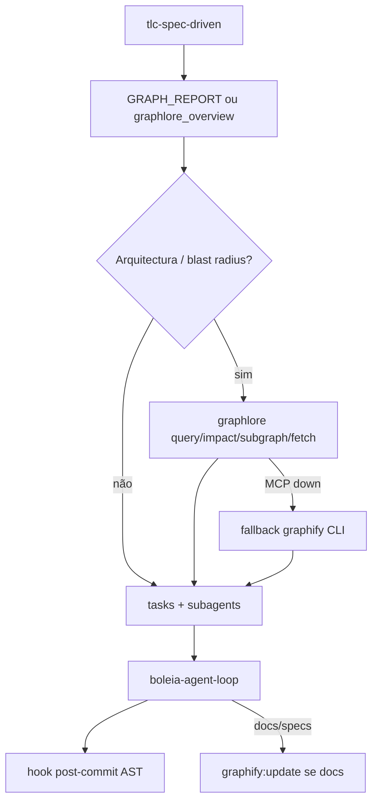

# Actualizar graphify + Graphlore no fluxo

## Referências

### `[graph-doc.md](graph-doc.md)` — princípios

- Paradoxo da Navegação: o gargalo é *descobrir o que ler*, não o tamanho da janela.
- AST `EXTRACTED` (1.0) vs `INFERRED` (hipóteses); nesta rebuild só code-only.
- Ler `GRAPH_REPORT.md` primeiro; God Nodes / Leiden / ciclos / surpresas.
- Cursor: `[.cursor/rules/graphify.mdc](.cursor/rules/graphify.mdc)` `alwaysApply: true`.
- Ignore fraco → God Nodes lixo (`GET()`, logger, skills).

### [Guide Ashok (gist)](https://gist.github.com/ashokvarmamatta/344a642e8b5bd286be605a8f439c3848) — operação MCP

Guia “Make Your AI Coding Assistant 500x Smarter”: mapa via grafo + MCP em vez de ler a codebase inteira.

Práticas a adoptar:


| Prática do gist                                          | No Boleia                                                                                      |
| -------------------------------------------------------- | ---------------------------------------------------------------------------------------------- |
| MCP como “garçom”; grafo como “menu”                     | Sim — agentes usam tools MCP antes de Grep/Read em massa                                       |
| Dois servidores: `code-review-graph` + `graphify.serve`  | **Não** — ver decisão abaixo                                                                   |
| `.mcp.json` no projecto (commitar)                       | Sim — Cursor: `[.cursor/mcp.json](.cursor/mcp.json)`; espelho `[.mcp.json](.mcp.json)` na raiz |
| `graphify cursor install`                                | Sim — complementar rule manual                                                                 |
| `graphify hook install` (post-commit / post-checkout)    | **Sim** nesta passagem (AST only, sem LLM)                                                     |
| Gitignore `graphify-out/` (rebuild local)                | **Sim** — deixar de versionar artefacto gerado stale                                           |
| Smoke: pergunta de arquitectura → tool MCP, **não** Grep | Sim — critério de validação                                                                    |
| Update manual após docs/imagens                          | Docs: `/graphify . --update` ou `graphlore_build` quando `.md`/specs mudarem                   |
| Troca de branch → update                                 | Coberto pelo hook post-checkout                                                                |


#### Decisão MCP (vs duo do gist)

O gist recomenda **dois** MCPs:

- `code-review-graph` — AST rápido (callers, impact, review)
- `graphify.serve` — enciclopédia completa

No Boleia escolhemos **um** MCP: **[Graphlore](https://github.com/yasinyaman/graphlore)** sobre `graphify-out/graph.json`.

Motivo: Graphlore já cobre overview / query / path / impact / fetch / freshness / build / cycles (papel “dicionário rápido” + navegação do grafo Graphify), com spans JSX via `[treesitter]`. Evita superfície tripla de tools e conflito de nomes (`query_graph` em dois servers).

`code-review-graph` e `graphify.serve` ficam **fora de âmbito** (fallback futuro só se Graphlore falhar no Cursor).

## Diagnóstico

- `[graphify-out/graph.json](graphify-out/graph.json)` stale (legado `RouteService`; falta marketplace canónico)
- Ruído de skills / God Nodes enviesados
- Sem `GRAPH_REPORT.md`; MCP vazio em `[.cursor/mcp.json](.cursor/mcp.json)`
- Rule graphify só em `.agents/`, não always-apply Cursor
- Artefacto `graphify-out/` versionado e desactualizado (o gist recomenda o contrário)

## Papéis


| Camada          | Ferramenta                  | Função                               |
| --------------- | --------------------------- | ------------------------------------ |
| Extracção       | **Graphify** (`graphifyy`)  | AST → `graphify-out/`                |
| MCP / navegação | **Graphlore**               | Tools no Cursor; wrap `graphify` CLI |
| Princípios      | `graph-doc.md` + gist Ashok | Porquê + como operar / automatizar   |


## Âmbito do grafo

`[.graphifyignore](.graphifyignore)` produto-first:

- Incluir: `src/`, `supabase/`, `AGENTS.md`, `.cursorrules`, `.specs/`
- Excluir: `.agent/`, `.agents/`, `node_modules/`, `dist/`, `*.min.js`, caches, HTML gerados

Rebuild `**--code-only**` (AST local).

## 1. Install + rebuild

1. `uv tool install graphifyy` (ou pipx; PyPI = `graphifyy` com dois y).
2. `uv tool install "graphlore[treesitter]"` (+ opcional `semble`, `tiktoken`).
3. Criar `.graphifyignore`.
4. Rebuild limpo → `graph.json` + `**GRAPH_REPORT.md**` + viz.
5. `graphify cursor install` (além da rule `.mdc` que vamos escrever/alinhar).

Validação domínio + qualidade (graph-doc + gist):

- Serviços canónicos presentes; legado `RouteService` ausente
- God nodes = domínio Boleia (senão apertar ignore)
- Ler `GRAPH_REPORT.md`

## 2. MCP Graphlore (Cursor + raiz)

`[.cursor/mcp.json](.cursor/mcp.json)` e espelho `[.mcp.json](.mcp.json)` (commitáveis, como o gist):

```json
{
  "mcpServers": {
    "graphlore": {
      "command": "graphlore",
      "env": {
        "GRAPHLORE_PROJECT_DIR": "C:\\boleia-certa",
        "GRAPHLORE_OUT_DIR": "graphify-out",
        "GRAPHLORE_TOOLSET": "lean"
      }
    }
  }
}
```

- stdio; path absoluto Windows; recarregar MCPs no Cursor.
- Smoke (gist §3d): *“Quais são os nós mais conectados?”* → `graphlore_overview` / god nodes — **não** Grep em massa.

## 3. Automação de freshness (gist §4)

1. `graphify hook install` — post-commit + post-checkout (AST only).
2. Adicionar a `[.gitignore](.gitignore)`:

```gitignore
# Knowledge graph outputs (rebuild: graphify extract / graphlore_build)
graphify-out/
```

1. Remover do índice git (quando commit for pedido): `git rm -r --cached graphify-out/` — manter ficheiros locais.
2. `[package.json](package.json)`: `"graphify:update": "graphify update ."` para update manual sem commit.
3. Docs/specs alterados (não só código): `graphlore_build` / update semântico conforme necessário (gist: docs não vão no hook AST).

## 4. Fluxo de trabalho agentes




Ficheiros / docs a alterar:


| Path                                              | Mudança                                                                 |
| ------------------------------------------------- | ----------------------------------------------------------------------- |
| `.graphifyignore`                                 | Novo                                                                    |
| `.gitignore`                                      | Ignorar `graphify-out/`                                                 |
| `.cursor/mcp.json` + `.mcp.json`                  | Graphlore                                                               |
| `.cursor/rules/graphify.mdc`                      | alwaysApply; MCP-first; EXTRACTED vs INFERRED; links a graph-doc + gist |
| `multi-agent-loop.mdc` + orchestrator/implementer | Passo grafo + impact + freshness                                        |
| `AGENTS.md`                                       | Secção Graphify + Graphlore; refs                                       |
| `.agents/rules` + workflow graphify               | Alinhar; smoke checklist                                                |
| `package.json`                                    | `graphify:update`                                                       |


Ordem de consulta:

1. Freshness / overview / `GRAPH_REPORT.md`
2. Query / path / impact / subgraph
3. Fetch código do nó
4. Grep/Read só se o mapa não bastar

## 5. Entrega

- Grafo regenerado + report útil
- Graphlore MCP activo; smoke “MCP not Grep”
- Hooks + gitignore `graphify-out/`
- Rules/AGENTS alinhados a graph-doc + gist
- Sem commit automático (quando pedires: incluir untrack de `graphify-out/`)

## Fora de âmbito

- Instalar `code-review-graph` + `graphify.serve` em paralelo
- MCP HTTP multi-project / global `~/.claude.json` (gist §multi-project)
- Whisper / pass LLM deep em massa
- Reindexar `.agent/skills`

