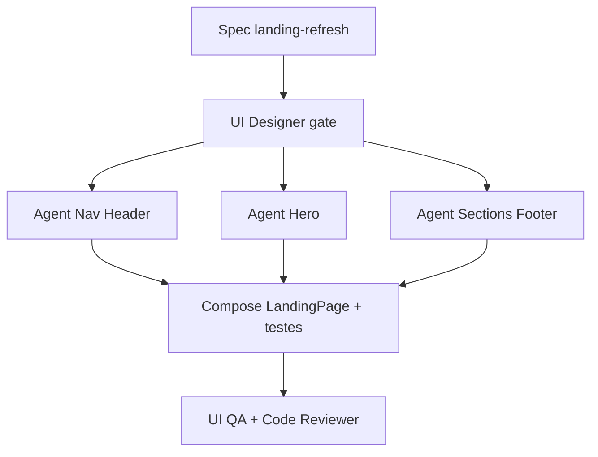

# Refatoração completa da Landing Page

## Diagnóstico (estado actual)

Em `[src/pages/LandingPage.jsx](src/pages/LandingPage.jsx)`:

- **Menu mobile:** ícone `Menu` dentro de um `div` sem `onClick`, sem estado, sem painel — só decorativo.
- **Nav / footer:** links `href="#"` (Como funciona, Vantagens, Segurança, Termos, Privacidade, Contacto, Blog) — não navegam nem fazem scroll.
- **Hero:** `backgroundImage` com URL `lh3.googleusercontent.com` (stock frágil, off-brand, dependência externa).
- **Copy:** ainda fala de “rotas” genéricas; falta secção **Segurança** (link existe, conteúdo não); claim “centenas de pessoas” sem base.
- **CTAs auth** já funcionam (`/auth?mode=register&role=…` → `[useAuthForm](src/hooks/useAuthForm.js)` lê `mode`/`role`).

Só existe `[button.jsx](src/components/ui/button.jsx)` em shadcn; o padrão de drawer mobile a reutilizar é o de `[NotificationBell.jsx](src/components/NotificationBell.jsx)` (overlay + painel deslizante).

## Decisão visual (passe livre — recomendado)

**Remover a foto stock.** Substituir por hero **full-bleed** com:

- Gradiente/atmosfera urbana (tokens `--color-primary`, `background-light/dark` em `[src/index.css](src/index.css)`)
- Marca `boleia-logo.png` como sinal hero-level
- Headline + 1 frase + CTAs Passageiro/Motorista
- Mock leve do produto em JSX/CSS (cartão “Oferta / Procura / Acordo · Kz”) — **sem** URL externa e **sem** imagem gerada obrigatória

Motivo: moderno, leve, on-brand (Luanda / boleias diárias), zero dependência externa, alinhado às regras de landing (full-bleed, brand first, sem card no hero).

## Copy / conteúdo

Actualizar para domínio marketplace (PT-PT, Kz):


| Secção           | Mensagem                                                                                 |
| ---------------- | ---------------------------------------------------------------------------------------- |
| Hero             | Matchmaking casa–trabalho: procura/oferta → proposta → acordo mensal                     |
| Como funciona    | 1) Publica procura ou oferta 2) Combina proposta/grupo 3) Acordo 1:N com preço em Kz     |
| Vantagens        | Economia, pontualidade, grupo de colegas                                                 |
| Segurança (nova) | Perfis, acordos claros, faltas rastreáveis — tom utilitário                              |
| CTA final        | Soft claim (“Junta-te ao Boleia Certa”) sem números inventados                           |
| Footer           | Remover Blog; Termos/Privacidade → âncoras ou mailto contacto; link **Entrar** → `/auth` |


## Arquitectura de ficheiros (para paralelismo)

Partir o monolito em componentes com **scopes disjuntos**:

```
src/pages/LandingPage.jsx          → composição + ids de secção
src/components/landing/
  LandingHeader.jsx                → nav + menu mobile + ThemeToggle
  LandingHero.jsx                  → hero full-bleed (sem foto externa)
  LandingHowItWorks.jsx
  LandingBenefits.jsx
  LandingSecurity.jsx
  LandingCta.jsx
  LandingFooter.jsx
src/pages/LandingPage.test.jsx     → actualizar + testes menu/âncoras
.specs/features/landing-refresh/   → spec.md, design.md, tasks.md
.agent/subagents/boleia-landing-*  → prompts especializados (subagent-creator)
```




## Fluxo de execução (orquestrador)

1. **Specify (Medium/Large):** `.specs/features/landing-refresh/spec.md` com IDs (ex. `LP-01` menu, `LP-02` hero, `LP-03` copy, `LP-04` âncoras).
2. **Design gate:** seguir `[.cursor/skills/boleia-agent-loop/ui-designer](.cursor/skills/boleia-agent-loop/ui-designer/SKILL.md)` — UI Skills + Mobbin free-safe (`standard`, `limit`≤5) + v0 via One se disponível; degradar se MCP falhar. Artefacto `design.md`. Sem Penpot.
3. **Criar subagentes** (pedido explícito + [subagent-creator](.cursor/skills/subagent-creator/SKILL.md)):
  - `boleia-landing-nav` — header/menu mobile/a11y
  - `boleia-landing-hero` — hero sem stock
  - `boleia-landing-sections` — como funciona / vantagens / segurança / CTA / footer
4. **Execute em paralelo** (`Task` no mesmo turno) após design APPROVE, TDD por componente:
  - Testes primeiro → falhar → implementar → verde
5. **Compose** no orquestrador: `LandingPage.jsx` monta tudo; âncoras `id="como-funciona"`, `id="vantagens"`, `id="seguranca"`.
6. **Gates:** `ui-qa` + `code-reviewer` em paralelo; `npm run lint` + `npm run test:run`.
7. **Docs:** actualizar bloco de estado em `[AGENTS.md](AGENTS.md)` (landing refresh).

## Menu mobile (comportamento concreto)

- `button` com `aria-expanded` / `aria-controls`
- Estado `menuOpen`; fechar em Escape, overlay click, e ao escolher link
- Painel (padrão NotificationBell): links âncora + “Entrar” + CTAs Passageiro/Motorista
- Scroll suave via `href="#…"` nos `id`s das secções

## Fora de âmbito

- Não criar páginas Termos/Privacidade completas neste ciclo (só links honestos).
- Não alterar fluxo Auth além do que já existe via query string.
- Sem commit automático (só handoff se pedires).

## Verificação

- Menu mobile abre/fecha e navega para secções (testes + smoke browser).
- Sem URL `googleusercontent` no código.
- CTAs Passageiro/Motorista/Começar/Entrar → `/auth…`.
- Testes Landing actualizados (texto hero novo + menu).
- Lint + Vitest verdes.

