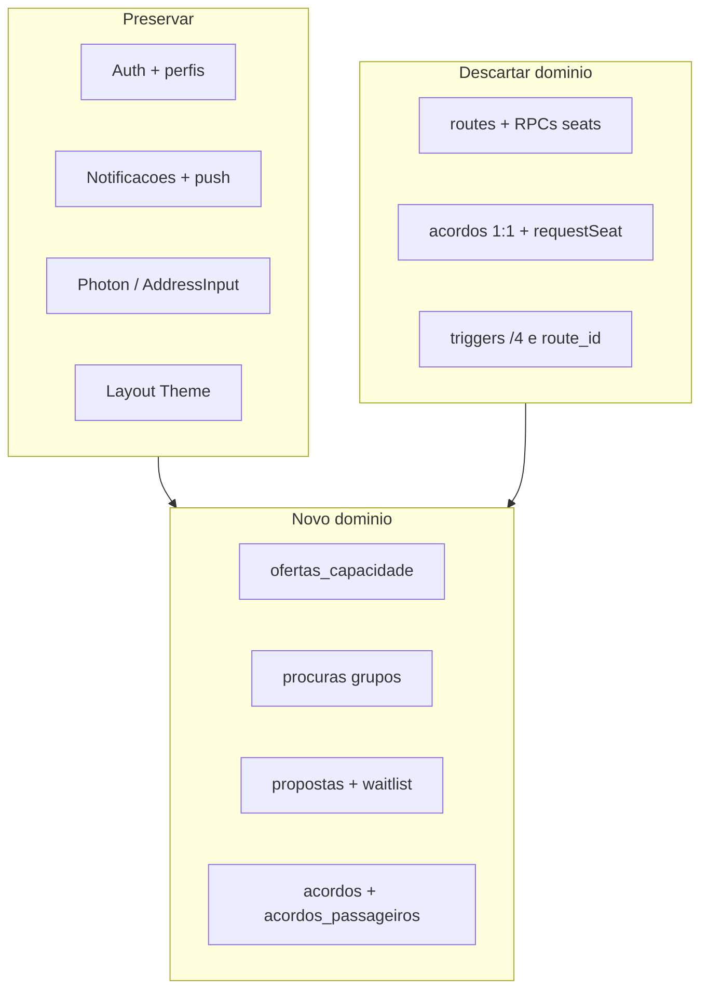

# Marketplace — verificação final + estratégia limpa

## Decisão de produto (aprovada)

- Dados actuais na BD são **só teste** → podem ser **apagados** (TRUNCATE/DROP do domínio antigo).
- **Não** fazer expand-contract, backfill, dual-write, nem wrappers só para preservar dados.
- **Não** tratar “dados descartáveis” como “código descartável”: preservar infra e componentes reutilizáveis; o modelo de negócio legado **não** limita o novo domínio.

---

## Verificação final — o que NÃO se pode perder

### PRESERVE (as-is)

| Área            | Artefactos                                                                                                                                                                                                                         |
| --------------- | ---------------------------------------------------------------------------------------------------------------------------------------------------------------------------------------------------------------------------------- |
| Auth            | `[AuthContext.jsx](src/contexts/AuthContext.jsx)`, `[ProtectedRoute.jsx](src/components/ProtectedRoute.jsx)`, `[Auth.jsx](src/pages/Auth.jsx)`, `[useAuthForm.js](src/hooks/useAuthForm.js)`, `[supabase.js](src/lib/supabase.js)` |
| BD auth         | Tabela `perfis` (+ `onboarding_completed`), trigger `handle_new_user` / `on_auth_user_created`, RLS `perfis_*`                                                                                                                     |
| Shell           | `[Layout.jsx](src/layouts/Layout.jsx)` (estrutura), Theme, `[UpdatePrompt](src/components/UpdatePrompt.jsx)`                                                                                                                       |
| Push            | `[NotificationBell](src/components/NotificationBell.jsx)`, `useNotifications`, `usePushNotifications`, `[sw.js](src/sw.js)`, Edge `send-push`, tabelas `notificacoes` + `push_subscriptions` + RLS, secrets VAPID                  |
| Geo             | `[LocationService.js](src/services/LocationService.js)`, `useAutocomplete`, `AddressInput`, `AutocompleteDropdown` (Photon AO)                                                                                                     |
| Perfil          | `[Profile.jsx](src/pages/Profile.jsx)`, `[OnboardingPermissions.jsx](src/components/OnboardingPermissions.jsx)`, ProfileService (perfil)                                                                                           |
| Utils           | `errorHandler`, `formatKwanza`/`formatters`, `validation`, `cn`                                                                                                                                                                    |
| UI genérica     | `ConfirmationModal`, `PageShell`, `PageHeader`, `EmptyState`, `LoadingSkeleton`                                                                                                                                                    |
| Paths           | `/`, `/auth`, `/perfil`, `/veiculo`, `/faltas`, `/faltas/:acordoId`, `/acordos`, `/passageiro`, `/motorista` (paths mantêm-se; páginas de domínio substituem-se)                                                                   |
| Observabilidade | Sentry em `main.jsx` (`VITE_SENTRY_DSN`)                                                                                                                                                                                           |

### ADAPT (leve)

| Área                                | Mudança                                                                              |
| ----------------------------------- | ------------------------------------------------------------------------------------ |
| BottomBar em `Layout.jsx`           | Labels/destinos se o fluxo mudar                                                     |
| `notificationRouter.js` + metadata  | Novos `type`s; manter deep link `/acordos?openAcordoId=` quando possível             |
| `VehicleSetup` / `veiculos`         | `lugares_disponiveis` → `capacidade_total` + `vagas_passageiros`; ligar a oferta     |
| `AbsenceTracker` / `AbsenceService` | Continua `/faltas`; lê acordos 1:N; trigger sem `/4`                                 |
| `EstadoBadge`                       | Novos estados se necessário                                                          |
| `App.jsx`                           | Trocar page components; `/publicar-trajeto` → criar oferta (manter path ou renomear) |
| Trigger notificações de acordo      | Reescrever para `oferta`/`driver_id` + N passageiros (não apagar o canal push)       |

### REPLACE / DELETE (domínio legado)

| Camada      | Alvo                                                                                                                                                                                                                  |
| ----------- | --------------------------------------------------------------------------------------------------------------------------------------------------------------------------------------------------------------------- |
| BD          | `routes`; RPCs `decrement/increment_available_seats`; índice `unique_active_route_passenger`; CHECK `available_seats > 0`; trigger `handle_acordo_notifications` (versão routes); `handle_falta_desconto` com `/4/22` |
| BD acordos  | Schema 1:1 (`passenger_id` + `route_id` no cabeçalho) → cabeçalho contrato + `acordos_passageiros`                                                                                                                    |
| Serviços    | `RouteService` / `publishRoute`, `AgreementsService.requestSeat` e joins `routes`, RPCs ±1                                                                                                                            |
| Páginas     | `PassengerDashboard`, `DriverDashboard`, `PublishRoute`, `MyAgreements` (+ testes E2E/lifecycle associados)                                                                                                           |
| Componentes | `AcordoCardMotorista/Passageiro`, `AcordoDetailsModal`, `AcordoKebabMenu` (acoplados a `acordo.routes.*`)                                                                                                             |
| Docs        | Secções de `AGENTS.md` que dizem “`routes` = única fonte de verdade”                                                                                                                                                  |

### Riscos se o corte limpo for feito mal

1. Apagar `handle_new_user` → signup sem `perfis` / sem `tipoPerfil`.
2. Apagar RLS de `perfis` / `notificacoes` / `push_subscriptions` → app “vazia” ou push morto.
3. Partir contrato `notificacoes.metadata` sem actualizar `notificationRouter` + `sw.js`.
4. Apagar `handle_new_notification_push` / VAPID / Edge `send-push`.
5. Dropar `faltas` ou FK sem redesenhar AbsenceTracker.
6. Esquecer `veiculos` UNIQUE `id_motorista` ao alterar colunas.
7. Reintroduzir Google Maps / `rotas_diarias` / TypeScript (proibido pelas regras do repo).

**Conclusão da verificação:** nenhuma dependência essencial impede a reconstrução limpa, **desde que** a migração preserve o bloco auth/perfis/push/notificações/geo/shell e só destrua o domínio `routes`↔`acordos` 1:1.

---

## Estratégia de implementação (reconstrução limpa)

### Ordem de execução (após aprovação para Agent)

1. **Spec** — `.specs/features/marketplace-oferta-procura` (cardinalidade 1:N, `POR_PASSAGEIRO`  `TOTAL_ACORDO`, fórmula faltas, invariante de vagas).
2. **Migração Supabase MCP (uma passagem limpa):**
  - TRUNCATE/DROP dados e objectos do domínio antigo (`faltas` → `acordos` → `routes`; dropar RPCs e funções legadas).
  - ALTER `veiculos`: `capacidade_total`, `vagas_passageiros`; remover ambiguidade de `lugares_disponiveis`.
  - CREATE `ofertas_capacidade` (`modo_preco`, `valor_mensal_ask_kz`, `vagas_totais`, `vagas_disponiveis >= 0`, `flexibilidade_rota`, estado, OD **se fixa** / sem OD se flexível, horários, `veiculo_id`, `driver_id`). Sem polígonos/zonas no MVP.
  - CREATE `procuras`, `grupos`, `membros_grupo`, `propostas`, `lista_espera`.
  - CREATE/REPLACE `acordos` (cabeçalho sem `passenger_id`; preços + `n_passageiros_contrato` congelados) + `acordos_passageiros` (`quota_mensal_kz` igual e persistida; saída não recalcula preço).
  - RPC/transacção `accept_proposal` (lock oferta, `N <= vagas_disponiveis`, insert acordo + N pax, recalcular **vagas** pela soma de passageiros activos — sem tocar quotas).
  - Trigger faltas: `valor_mensal_por_passageiro_kz` persistido / `dias_uteis_mes` — **zero** literais `/ 4` e zero `total/N_activos`.
  - Teste de regressão obrigatório: saída de passageiro não altera quotas do mês corrente.
  - Trigger notificações alinhado ao novo modelo; manter pipeline push.
  - RLS completa nas tabelas novas; não tocar RLS de `perfis`/`notificacoes`/`push_subscriptions` excepto se referirem `routes`.
3. **Serviços + TDD** (Vitest primeiro): `resolveAgreementPricing`, matching, waitlist, `createAgreementFromProposal`, AbsenceService.
4. **UI Penpot-first**: análise UX → [opcional Superdesign] → consolidar no Penpot (componentes/estilos/tokens existentes; reutilização) → gate “design pronto” (user flow + estados + componentes + telas no Penpot) → implementar → Visual QA. Ecrãs: oferta com selector de modo de preço; procura/grupo; propostas; mapa N pontos; waitlist; acordo multi-passageiro; adaptar VehicleSetup e faltas; registar em `App.jsx`.
5. **Docs**: `AGENTS.md` — oferta/procura como fonte de verdade; remover premissas `routes`/`requestSeat`.

### Fora de âmbito (inalterado)

Gateway de pagamento; substituto automático; routing turn-by-turn; TypeScript; toast; `rotas_diarias`.

---

## Relação com o plano de produto

O modelo de domínio em `[.cursor/plans/marketplace_oferta_procura_74cbb52a.plan.md](.cursor/plans/marketplace_oferta_procura_74cbb52a.plan.md)` mantém-se. Este documento **substitui** apenas a secção de migração expand-contract / legacy-routes por **reconstrução limpa**.