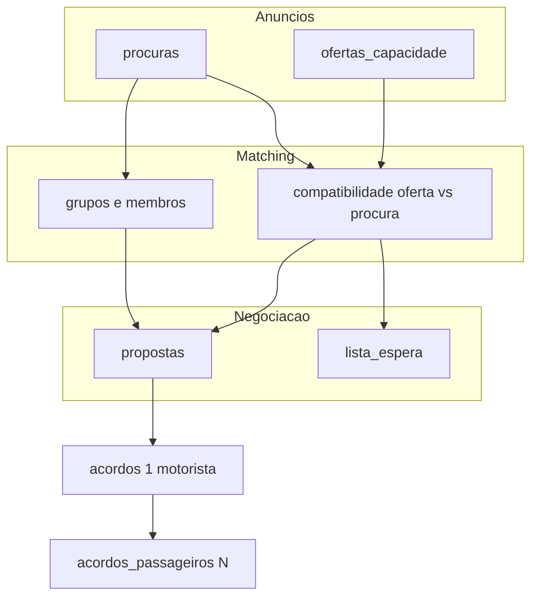

# Marketplace de oferta e procura (bifurcação de modelo)

## Correção de interpretação (obrigatória)

O plano **não** modela matching 1-a-1 no sentido de «um negócio = um motorista + um passageiro».

### Cardinalidade correcta

| Relação | Cardinalidade | Limite |
|---|---|---|
| Motorista → passageiros no acordo | **1 → N** | `vagas_disponiveis` do veículo/oferta |
| Procura/grupo → **propostas** (qualquer sentido) | **1 → M** | Várias propostas abertas; **nunca** «1 procura = 1 motorista» |
| Proposta aceite → acordo | **1 → 1** | Aceitar cria **um** acordo: 1 motorista + N passageiros |
| Acordo | **1 contrato** com **N** linhas em `acordos_passageiros` | N = `N_contrato` na aceitação |

- Cadeia canónica: **Procura/grupo → M propostas → 1 aceite → 1 acordo 1:N**.
- Matching é entre **oferta de capacidade** e **procura** (individual ou grupo), não entre motorista e um único passageiro.
- Um acordo activo pode (e tipicamente deve) conter vários passageiros.
- N = 1 é apenas o caso degenerado (procura individual), **não** a regra de domínio.
- Um motorista pode ter **um ou mais** acordos activos em paralelo **somente** se a soma dos passageiros activos em todos os seus acordos ≤ vagas da oferta; cada acordo continua a ser 1:N.
- Proibido residual «Procura → Motorista 1:1» como regra de domínio.

### Preço: dois modos na oferta

| Modo | O motorista define | O sistema calcula **na aceitação** (e congela) |
|---|---|---|
| `POR_PASSAGEIRO` | Valor mensal **individual** (ex. 40.000 Kz) | `total = individual × N_contrato` |
| `TOTAL_ACORDO` | Valor mensal **total** do acordo (ex. 120.000 Kz) | `individual = total / N_contrato` |

Exemplos na aceitação (`TOTAL_ACORDO` = 120.000 Kz):

- `N_contrato` = 3 → 40.000 Kz/passageiro (persistido)
- `N_contrato` = 4 → 30.000 Kz/passageiro (persistido)

Após criação, estes valores **não** mudam se `N_activos` mudar.

**Regra crítica (capacidade ≠ preço):** a lotação máxima do veículo define **capacidade máxima**, **nunca** o divisor do preço.

Dois Ns distintos — não misturar:

| Símbolo | Significado | Uso |
|---|---|---|
| `N_contrato` | Passageiros no momento da aceitação/criação do acordo | Resolvido **uma vez** e **congelado** nos campos de preço do contrato |
| `N_activos` | `COUNT(acordos_passageiros WHERE estado = 'activo')` **agora** | Só **capacidade** / `vagas_disponiveis` / UI de lotação — **nunca** recalcular quotas do mês corrente |

**Quatro Ns no domínio completo (grupo vivo):**

| Símbolo | Significado |
|---|---|
| `N_actual` | Membros activos no grupo agora (`n_candidato`) |
| `N_proposto` | Snapshot na proposta |
| `N_contrato` | Snapshot no acordo aceite |
| `N_activos` | Activos no acordo (capacidade) |

### Faltas / descontos: sem divisores fixos

Proibido no schema, triggers e serviços:

- `/ 4`, `/ 2`, ou qualquer constante «número típico de passageiros»
- Usar `vagas_totais` / `capacidade_total` / `available_seats` do veículo como divisor de preço ou de desconto
- Recalcular `desconto_kz` ou quota com `valor_mensal_total_kz / N_activos` após saída de passageiro

Fórmula obrigatória (cláusula 9ª, generalizada):

```
desconto_kz = acordos.valor_mensal_por_passageiro_kz / acordos.dias_uteis_mes
```

quando a falta cobre ida **e** regresso (se `regra_desconto_falta = so_ida_e_regresso`).

Fonte: coluna **persistida** no cabeçalho (quota congelada na criação), **não** um valor derivado do N actual.

---

## Diagnóstico do código actual (assumptions 1:1 a eliminar)

- [`acordos`](supabase/migrations/20260329161035_remote_schema.sql): `passenger_id` singular + `route_id` → **1 acordo = 1 passageiro**. Evoluir para cabeçalho do contrato + `acordos_passageiros`.
- [`requestSeat(routeId, passengerId)`](src/services/AgreementsService.js): cria acordo 1:1; deixa de ser o caminho canónico.
- Trigger `handle_falta_desconto`: `monthly_price_per_seat / 4.0 / 22.0` → **divisor hardcoded 4**; substituir por valor do acordo / `dias_uteis` do acordo.
- Default `faltas.desconto_kz = 1590.91` → valor ilustrativo do contrato de exemplo; não pode ser default de negócio.

---

## Modelo unificado

### Dois tipos de oferta (decisão de produto 2026-09-05)

| Tipo | Significado | Campos MVP | Matching |
|---|---|---|---|
| **Oferta fixa** | `flexibilidade_rota = false` | OD + horário + dias + capacidade + preço | Geo OD + tempo + capacidade |
| **Oferta flexível** | `flexibilidade_rota = true` | Capacidade + disponibilidade + dias + janela/horário + preço (**sem** OD obrigatório) | Sem OD da oferta; sem zona/raio residencial; horário/janela + dias + capacidade; **motorista decide caso a caso** |

**Não é:** «motorista profissional = zonas + janelas».  
**Não é:** «flexível = rota OD com flag».  
**Fora do MVP:** polígonos, zonas geográficas, raio a partir da residência, exclusão de procuras por distância residência↔recolha. A residência do motorista **não** define área de atuação (ex.: mora em Viana e pode aceitar Talatona/Kilamba/Benfica se conveniente).

- **Passageiro / grupo** = procura (demanda), eventualmente agregada.
- Objecto final: **acordo multi-passageiro** alinhado ao [contrato particular](CONTRATO_PARTICULAR_DE_PRESTACAO_DE_SERVICO_DE_TRANSPORTE.md).



Decisões fechadas: modelo completo na fase 1; vagas a 0 → **lista de espera** (não fechar anúncio); cardinalidade **1:N**; preço **POR_PASSAGEIRO | TOTAL_ACORDO**.

---

## Entidades (schema conceptual)

### `veiculos` (estender)

- `capacidade_total` (lugares do carro, inclui motorista)
- `vagas_passageiros` = `capacidade_total - 1` (só capacidade; **nunca** entra em fórmulas de preço)
- Separar o actual `lugares_disponiveis` ambíguo

### `ofertas_capacidade`

- `driver_id`, `veiculo_id`
- `vagas_totais`, `vagas_disponiveis` (decremento = **N** passageiros do acordo aceite, não «1 por acordo»)
- `modo_preco`: `POR_PASSAGEIRO` | `TOTAL_ACORDO`
- `valor_mensal_ask_kz`: interpretação depende do modo
  - `POR_PASSAGEIRO` → ask individual
  - `TOTAL_ACORDO` → ask total do acordo (ponto de partida da negociação)
- `flexibilidade_rota` (`false` = oferta **fixa** com OD; `true` = oferta **flexível** sem OD obrigatório)
- Oferta fixa: origem/destino + coords + horário + dias
- Oferta flexível: capacidade + disponibilidade + dias + janela/horário + preço — **sem** polígonos/zonas/raio residencial no MVP
- `estado`: `inactiva` | `disponivel` | `parcial` | `cheia`

Ask ≠ preço final do contrato. Preço final resolve-se na proposta aceite e congela-se no acordo.

### `procuras` / `grupos` / `membros_grupo`

Grupo = **procura colectiva viva** (não pacote fechado):

- `N_actual` = membros activos agora (coluna `procuras.n_candidato`)
- `n_maximo` = capacidade pretendida pelo criador (grupo continua aberto e negociável se `N_actual < n_maximo`)
- OD, horários, dias, pontos preferenciais por membro
- **Sem** preço próprio obrigatório — preço nasce na oferta/proposta do motorista
- Descoberta pública + pedido de entrada; convite por telefone = fallback transitório apenas

**Proibido:** exigir grupo «completo» (`N_actual == n_maximo`) para procurar, enviar ou receber propostas.

### `propostas`

Liga `oferta_id` + `procura_id`/`grupo_id` (não «um passenger_id» como único sujeito).

**Sentidos (bidireccionais):**

| Sentido | Criador (`created_by`) | Aceita/recusa (só contraparte) |
|---|---|---|
| **A** | Owner procura/grupo | Motorista da oferta |
| **B** | Motorista | Owner procura/grupo |

Regra: **quem criou NÃO pode aceitar nem rejeitar**. Snapshot `N_proposto` **imutável** se `N_actual` mudar.

Campos de preço:

- `created_by` (obrigatório para a regra de contraparte)
- `modo_preco` (copiado/negociável a partir da oferta)
- `valor_mensal_ask_kz` (termo em negociação: individual **ou** total, conforme modo)
- `n_passageiros_propostos` (= **`N_proposto`**: snapshot de `N_actual` no instante da proposta — **imutável** nessa versão)
- `valor_mensal_por_passageiro_resolvido_kz` (derivado na aceitação)
- `valor_mensal_total_resolvido_kz` (derivado na aceitação)
- `estado`

Resolução na aceitação (N = `N_proposto` → `N_contrato`):

```
se POR_PASSAGEIRO:
  individual = valor negociado
  total = individual * N
se TOTAL_ACORDO:
  total = valor negociado
  individual = total / N   // N = N_proposto, nunca vagas do carro nem n_maximo
```

Se `N_actual` mudar depois: propostas abertas **mantêm** o snapshot. Renegociar com outro N → **nova** proposta (não mutar nem invalidar automaticamente a antiga só por entrada de membro).

Exemplo: grupo 2/4; proposta TOTAL 100.000 com `N_proposto=2` → 50.000/pax. Entra 3.º → proposta inalterada. Nova proposta N=3 → resto 33334+33333+33333.

Aceitação com grupo: incluir os primeiros `N_proposto` membros activos por `ordem_insercao` se `N_actual > N_proposto`; falhar se `N_actual < N_proposto`.

### `acordos` (cabeçalho do contrato) + `acordos_passageiros` (N)

**Acordo (1 linha) — preços congelados na criação:**

- `oferta_id`, `procura_id` / `grupo_id`, `driver_id`
- `modo_preco`
- `n_passageiros_contrato` — snapshot de `N_contrato` na aceitação (imutável sem adenda)
- `valor_mensal_total_kz` — congelado na criação
- `valor_mensal_por_passageiro_kz` — congelado na criação; **fonte única** para faltas e cobrança do mês corrente
- `dias_uteis_mes` (default 22, configurável **por acordo**)
- `valor_diario_por_passageiro_kz` = `valor_mensal_por_passageiro_kz / dias_uteis_mes` (gerado ou view; também derivado do valor congelado)
- `dia_pagamento`, vigência, `aviso_previo_dias`, `tolerancia_atraso_min`, `regra_desconto_falta`
- `estado`: activo | suspenso | cancelado | expirado

**Sem** `passenger_id` no cabeçalho.

#### Invariante de quota (MVP — obrigatória no schema e nos serviços)

1. **Divisão igual:** todos os passageiros do mesmo acordo pagam a **mesma** quota individual.
2. **Congelamento:** na criação do contrato, gravar `valor_mensal_por_passageiro_kz` e `valor_mensal_total_kz` (e `n_passageiros_contrato`) como valores **acordados**. Não são vistas dinâmicas sobre `N_activos`.
3. **Proibido:** qualquer UPDATE/trigger/serviço que faça `valor_mensal_por_passageiro_kz = valor_mensal_total_kz / COUNT(activos)` (ou o inverso) quando um passageiro sai ou entra.
4. **Exemplo protegido:**
   - Criação: total 120.000 Kz, N=4 → 30.000 Kz/passageiro (persistido).
   - Um passageiro sai → `N_activos` passa a 3; **quota permanece 30.000 Kz**; total contratual do mês corrente **não** passa a 40.000×3 nem a 120.000/3.
5. **Mês seguinte / mudança de N:** só via **adenda/renegociação** (nova versão de preços ou novo acordo) — nunca mutação silenciosa do mês corrente.
6. Extensão futura (fora do MVP): quotas desiguais por passageiro; até lá, `acordos_passageiros.quota_mensal_kz` = cópia do valor do cabeçalho (mesmo para todos).

**Protecção técnica sugerida:**

- Colunas de preço do cabeçalho: escrita só em `createAgreementFromProposal` / RPC de adenda explícita (não em `leavePassenger`).
- `acordos_passageiros.quota_mensal_kz NOT NULL` preenchida na inserção com o valor congelado do cabeçalho.
- Testes: «sair passageiro não altera `valor_mensal_por_passageiro_kz` nem `quota_mensal_kz` dos que ficam».

**`acordos_passageiros` (N linhas):**

- `acordo_id`, `passenger_id`
- `quota_mensal_kz` — quota **efectivamente acordada** na criação (espelho igual para todos no MVP)
- pontos de recolha/desembarque **acordados**
- `estado` no acordo (`activo` | `saiu` | …)
- Saída (`saiu`): liberta vaga; **não** recalcula quotas dos restantes

### Invariante de capacidade (obrigatória)

`vagas_disponiveis` de uma oferta é a **capacidade restante global** daquela oferta, não o remanescente de um único acordo:

```
vagas_ocupadas = COUNT(
  acordos_passageiros activos
  JOIN acordos activos
  WHERE acordo.oferta_id = esta_oferta
)

vagas_disponiveis = vagas_totais - vagas_ocupadas
```

Implicações:

- Aceitar uma proposta com `N_proposto` passageiros só é válido se `N_proposto <= vagas_disponiveis` **no momento da aceitação**.
- A aceitação deve ser **atómica** (RPC / transacção com lock da oferta): recalcular ocupação, comparar com N, inserir acordo + N `acordos_passageiros`, actualizar `vagas_disponiveis` — ou falhar / enviar para lista de espera se `N_proposto > vagas_disponiveis`.
- Evita overbooking sob pedidos concorrentes (dois grupos a aceitar «as últimas» vagas ao mesmo tempo).
- Ao sair um passageiro ou cancelar um acordo: recalcular pela mesma fórmula (não confiar só em `+= 1` desincronizado).

### `lista_espera`

Por `oferta_id` + procura/grupo (ou passageiro). Não consome vaga. Promoção = notificação, não auto-aceitar.

### `faltas`

- Ligadas a `acordo_id` + opcionalmente `passenger_id` (quem faltou, dentro do acordo)
- `viagem`: `ida` | `regresso` | `ambas`
- Trigger: ler `acordos.valor_mensal_por_passageiro_kz` **congelado** e `acordos.dias_uteis_mes`; **nunca** `routes.monthly_price_per_seat`, `/ 4`, nem `total / COUNT(activos)`
- `N_activos` na UI de lotação ≠ divisor de desconto

---

## O que o plano anterior tinha de errado (checklist)

| Trecho antigo | Problema | Correcção |
|---|---|---|
| «Sempre por passageiro/mês, não total do carro a dividir no cadastro» | Negava o modo `TOTAL_ACORDO` | Oferta com `modo_preco` dual |
| `valor_mensal_total_kz` só como `preço × N` | Só cobre `POR_PASSAGEIRO` | Resolução bidireccional conforme modo |
| Implícito «acordo ≈ requestSeat 1 passageiro» | Modelo 1:1 legado | Acordo multi-passageiro desde o dia 1 |
| «lotação típica (ex. 4)» como limite de grupo | Risco de virar divisor | Limite = `vagas` da oferta alvo; 4 só como exemplo de UI |
| Fórmula antiga `/ 4 / 22` só «corrigir para mensal/22» | Ambígua sobre qual mensal | Explicitar mensal **por passageiro do acordo** / `dias_uteis` do acordo |
| `vagas_disponiveis` «ocupadas por acordos activos» | Sugere 1 acordo = 1 vaga | Ocupação = soma de passageiros activos em todos os acordos |
| Quota «espelha» / divide por N actual | Recalcularia 120k/3=40k após saída | Quota e totais **congelados** na criação; adenda só no mês seguinte |
| `N = COUNT(activos)` como divisor de preço após contrato | Mistura capacidade com cobrança | `N_contrato` congelado para preço; `N_activos` só para vagas |

---

## Máquinas de estado

Inalteradas na forma (oferta / procura / proposta / acordo), com a nuance:

- Transição `parcial` / `cheia` usa **soma de passageiros activos**, não número de acordos.
- Aceitar proposta com N > `vagas_disponiveis` → rejeitar ou waitlist; nunca criar acordo a meio.

---

## Matching

1. **Oferta fixa:** compatibilidade horária **e** geográfica (raio OD) oferta ↔ procura/grupo.
2. **Oferta flexível:** horário/janela + dias + capacidade — **sem** OD da oferta, **sem** zona/raio residencial; matching ajuda a descobrir; motorista decide caso a caso. API `findCompatibleProcuras(oferta)`.
3. Capacidade: `vagas_disponiveis >= N_actual` (aceite directo com `N_proposto = N_actual`); senão waitlist. Grupo incompleto vs `n_maximo` **não** bloqueia matching.
4. Preço: comparar ask (interpretado pelo `modo_preco`) com teto da procura — filtro suave. Preço vem do motorista, não do grupo.
5. Mapa com pontos preferenciais dos membros cobertos pelo `N_proposto` antes do aceite (quando houver coords na procura/membros).

---

## Regras de bordo (preço + cláusula 8ª + grupo vivo)

- Grupo incompleto (`N_actual < n_maximo`) continua público, recebe pedidos de entrada e propostas com `N_proposto = N_actual`.
- Entrada de membro **não** altera propostas abertas existentes (snapshot).
- Saída de um passageiro a meio do mês: quota desse mês **não reembolsada**; marcar `estado = saiu`; liberta 1 vaga (`N_activos`); promove waitlist; **preços do cabeçalho e `quota_mensal_kz` dos restantes ficam intactos**.
- Recálculo `individual = total / N'` (ou novo total) **apenas** no **mês seguinte** e **somente** via adenda/renegociação explícita — aplica-se a `TOTAL_ACORDO` e a qualquer renegociação sob `POR_PASSAGEIRO`.
- Sem adenda: quem fica continua a pagar a quota congelada (ex. 30.000 Kz); o motorista assume o buraco desse mês (ou acordam fora do sistema).
- Grupo a meio da **proposta** (ainda não contrato): se quiserem negociar outro N → nova proposta; a antiga mantém o seu `N_proposto`. Depois de contrato criado, N da proposta já não mexe nos preços sem adenda.

---

## Serviços (contratos de API a respeitar)

- `resolveAgreementPricing({ modo_preco, valor_ask_kz, n_passageiros })` → `{ valor_mensal_total_kz, valor_mensal_por_passageiro_kz }` — só para **negociação/aceitação**, não para leituras pós-saída
- `createAgreementFromProposal(propostaId)` → cria 1 acordo + N `acordos_passageiros` com `quota_mensal_kz` idêntica; persiste `n_passageiros_contrato` + totais/individuais **congelados**; decrementa vagas em N
- `leavePassenger` / cancelamento parcial → actualiza estado + vagas; **assert** que colunas de preço do acordo não mudam
- `renegotiateAgreementPricing` (adenda) → único caminho permitido para mutar preços / `n_passageiros_contrato` (mês seguinte)
- `logAbsence` / trigger: só lê `acordos.valor_mensal_por_passageiro_kz` persistido; testes devem falhar se aparecer literal `/ 4` ou recálculo por `COUNT(activos)`

---

## Ordem de implementação (schema primeiro — reconstrução limpa)

Dados actuais são de teste e podem ser apagados. **Sem** expand-contract, backfill, dual-write ou wrappers de compatibilidade. Preservar auth/perfis/push/geo/shell; substituir o domínio `routes` → `requestSeat` → acordo 1:1.

1. Spec de domínio em `.specs/features/marketplace-oferta-procura`
2. Migração Supabase limpa: dropar `routes`/RPCs/triggers legados; criar ofertas/procuras/grupos/propostas/`acordos`+`acordos_passageiros`/waitlist; `veiculos` com capacidade; faltas sem `/4`; `vagas_disponiveis >= 0`; RPC atómica de aceitação
3. Serviços + TDD (preço, acordo N, matching, waitlist, faltas)
4. UI (**v0-first** + shadcn; Penpot descontinuado como SoT): gate design → TDD → `src/` → Visual QA (selector de modo de preço; multi-passageiro; waitlist; Phase 7: flexível + propostas A/B)
5. Actualizar `AGENTS.md` quando o schema estiver estável

Verificação de dependências essenciais: [`.cursor/plans/mapa_impacto_marketplace_e95dd649.plan.md`](mapa_impacto_marketplace_e95dd649.plan.md).

## Phase 7 (docs 2026-09-05 — **não** implementar até pedido)

**Re-verificado vs decisão final:** flexível sem OD/zona; propostas bidireccionais; aceite só contraparte; Procura → M propostas → 1 acordo 1:N.

Ordem: **T32** aceite só contraparte → **T33** propostas B + inbox + deep links → **T34** oferta flexível sem OD → **T35** matching dual + `findCompatibleProcuras`.

Débito actual (código): T27 grava `flexibilidade_rota` mas ainda exige OD e matching ignora o tipo («flex = OD + flag» — **incorrecto**). Copy UI ainda pode dizer «Rota flexível» / «zona» em ecrãs legados — corrigir em T34/T35.

## Fora de âmbito

- Gateway de pagamento; substituto automático; routing turn-by-turn; TypeScript; toast; `rotas_diarias`.
- **Polígonos / zonas / raio residencial** do motorista (MVP). Residência ≠ área de atuação.
