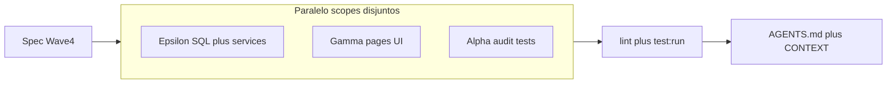

# Wave 4 — Consolidação MVP & PWA Offline

**Baseline:** HEAD `3a72e88`, working tree limpa.  
**Decisões:** **1C** (teto na procura + reforço quota no acordo) · **2C** (G9 faltas canónicas + overbooking/concorrência por mocks Vitest).  
**Spec:** criar `.specs/features/pwa-offline-wave4/` (spec breve + tasks) antes do Execute — herda out-of-scope de `[.specs/features/pwa-offline-first/spec.md](.specs/features/pwa-offline-first/spec.md)`.  
**Runner:** `npm run test:run` (não `pnpm`).  
**Graphlore:** MCP lean indisponível nesta sessão → fallback `[graphify-out/GRAPH_REPORT.md](graphify-out/GRAPH_REPORT.md)` + leitura dirigida; Grep só se o mapa não bastar. Em Execute, cada subagente tenta Graphlore (`search` → `neighbors`) antes de editar.

---

## Scopes paralelos (ficheiros disjuntos)

| Agente      | Escreve                                                                                                                                                                                                                                | Não toca            |
| ----------- | -------------------------------------------------------------------------------------------------------------------------------------------------------------------------------------------------------------------------------------- | ------------------- |
| **Epsilon** | `supabase/migrations/*_rpc_idempotency_wave4.sql`, `[AgreementService.js](src/services/AgreementService.js)`, `[GrupoService.js](src/services/GrupoService.js)`, `[offlineQueue.js](src/services/offlineQueue.js)` + testes de serviço | `src/pages/`*       |
| **Gamma**   | `[PassengerDashboard.jsx](src/pages/PassengerDashboard.jsx)` (+ test), `[MyAgreements.jsx](src/pages/MyAgreements.jsx)` (+ test); opcional extrair `[DiasSemanaPicker.jsx](src/components/DiasSemanaPicker.jsx)`                       | migrações / RPCs    |
| **Alpha**   | `[MarketplaceAuditScenarios.test.jsx](src/pages/MarketplaceAuditScenarios.test.jsx)`; se G9 precisar de helper puro, `src/utils/faltaDesconto.js` (+ test)                                                                             | UI pages de produto |

Paths do brief incorrectos: páginas em `src/pages/` (não `components/`); audit em `src/pages/MarketplaceAuditScenarios.test.jsx` (não `src/__tests__/`).

---

## Epsilon — Idempotência nas RPCs restantes

**Padrão já em produção (Wave 3):** `[20260905230000_rpc_idempotency_leave_cancel.sql](supabase/migrations/20260905230000_rpc_idempotency_leave_cancel.sql)` — tabela `rpc_idempotency`; early-return se chave existe; `INSERT` após sucesso.

**Nova migração (via Supabase MCP + ficheiro local)** para:

- `accept_proposal`
- `leave_grupo_membro`
- `renegotiate_agreement_pricing`
- `accept_agreement_adenda`

Comportamento: `p_idempotency_key uuid DEFAULT NULL`; se chave já em `rpc_idempotency` → **return sucesso sem reaplicar mutação** (mesmo contrato leave/cancel).

**Cliente:**

- `[AgreementService.createAgreementFromProposal](src/services/AgreementService.js)`, `renegotiateAgreementPricing`, `acceptAgreementAdenda` — gerar UUID v4, passar `p_idempotency_key`.
- `[GrupoService.sairDoGrupo](src/services/GrupoService.js)` — idem.
- Offline: wire `enqueueRpc` (já aceita qualquer `rpc` string) para estas mutações em falha de rede / offline, espelhando `leavePassenger` / `cancelProposta`.
- Actualizar JSDoc de `enqueueRpc` para listar as novas RPCs.

**TDD:** testes vermelhos → verdes em `AgreementService.test.js`, `GrupoService.test.js`, `offlineQueue.test.js` / `OfflineSyncEngine.test.js` — assert arg `p_idempotency_key` + dedupe enqueue.

---

## Gamma — UI (1C + Saída Pendente do brief Wave 4)

### P1 — Procura: `dias_semana` + `teto_mensal_kz`

Em `[PassengerDashboard.jsx](src/pages/PassengerDashboard.jsx)`:

- Estado do form: `dias_semana` (default `[1..5]`) + `teto_mensal_kz` (string/número controlado).
- **Picker:** reutilizar o padrão de chips de `[PublishRoute.jsx](src/pages/PublishRoute.jsx)` (`DIAS_SEMANA`, `aria-pressed`); preferir extrair `DiasSemanaPicker` partilhado para evitar drift (Gamma pode extrair; PublishRoute adopta no mesmo PR se scope couber — senão duplicar mínimo e extrair depois).
- Campo teto com label humana («Teto mensal») + sufixo **Kz**; validação básica (> 0 se preenchido).
- `createProcura({ ...form, dias_semana, teto_mensal_kz })` — serviço já persiste (`[ProcuraService.js](src/services/ProcuraService.js)` L42–46).
- Exibir teto nos cards de procura/matches do hub quando presente (`formatKwanza`).

**UI Skills + Stitch:** gate design leve (chips + input monetário) alinhado a tokens/`baseline-ui`; sem inventar ecrã novo completo.

### P2 — MyAgreements: reforço visual da quota congelada

Em cards activos de `[MyAgreements.jsx](src/pages/MyAgreements.jsx)`: destacar `quota_mensal_kz` (passageiro) / `valor_mensal_por_passageiro_kz` com `formatKwanza` + «Kz» — tipografia/hierarquia mais proeminente (não novo campo de domínio).

### P3 — Optimistic UI «Saída Pendente» (brief original Wave 4)

Quando `leavePassenger` devolve `{ offlineQueued: true }`:

- Marcar o acordo localmente (Set/`pendingLeaveIds` ou flag no item).
- Badge: *«Saída Pendente (A sincronizar...)»* + ícone loading subtil.
- Desactivar «Sair» / cliques repetidos até drain remover a chave (hook em `listPending` / evento `online` + `drainQueue`, ou limpar após sync bem-sucedido).
- **Não** depender só de `carregar()` que esconde o acordo.

**TDD UI:** `PassengerDashboard.test.jsx` (dias + teto no submit); `MyAgreements.test.jsx` (`offlineQueued` → badge + botão disabled).

---

## Alpha — Audit tests (2C)

Ficheiro: `[src/pages/MarketplaceAuditScenarios.test.jsx](src/pages/MarketplaceAuditScenarios.test.jsx)`.

**Nota de IDs:** o bloco activo G3/G4 do ficheiro ≠ tabela `[AUDIT_GAPS_WAVE.md](.specs/features/marketplace-oferta-procura/AUDIT_GAPS_WAVE.md)`. Wave 4 Alpha mapeia assim:

| Brief        | Implementação                                                                                                                                                                                                                                                                                                                                             |
| ------------ | --------------------------------------------------------------------------------------------------------------------------------------------------------------------------------------------------------------------------------------------------------------------------------------------------------------------------------------------------------- |
| **G9**       | Fórmula faltas: `desconto_kz = quota / dias_uteis_mês`. Preferir helper puro testável (ex. `computeFaltaDesconto(quota, diasUteis)`) + assert `30000/22 ≈ 1363.64`; documentar que o trigger BD deve espelhar (migração remota ainda tem `/4` legado em snapshot — Alpha **não** altera SQL neste wave salvo se Epsilon/orquestrador abrir task à parte). |
| **G3**       | Overbooking / capacidade: mocks estruturados — 1º `accept_proposal` ok, 2º rejeita «Vagas insuficientes» / waitlist; sem select parcial de acordo.                                                                                                                                                                                                        |
| **G4 / G10** | Concorrência multi-aceite por **mocks**: `rpc` mock sequenciado ou duas chamadas; segunda falha atómica no contrato cliente; **sem** `Promise.all` contra Postgres real.                                                                                                                                                                                  |
| **G6**       | Se no scope do un-skip: `createProposta` Sense B `created_by === motorista` (pode viver em `PropostaService.test.js` se mais limpo — Alpha coordena; um só sítio).                                                                                                                                                                                        |

Remover `describe.skip` / `it.todo` dos cenários cobertos; deixar G5/G7/G8/G11/G12 como todo só se explicitamente fora deste wave.

---

## Orquestração Execute

1. Spec Wave 4 em `.specs/features/pwa-offline-wave4/`.
2. Lançar **3 `Task` em paralelo** (scopes acima) com prompts dos skills `implementer` / `ui-designer`+implementer / TDD.
3. Gates: `npm run lint` + `npm run test:run`; code-reviewer (+ ui-qa em Gamma).
4. Actualizar `AGENTS.md` §9 (Wave 4 Done; próximo passo).
5. **Sem commit** até pedido explícito; handoff com mensagem sugerida.

---

## Riscos / limites conscientes

- Concorrência real Postgres (race true) **fora** de 2C — só contrato cliente + mensagens RPC.
- Trigger faltas no snapshot SQL local ainda legado `/4` — G9 verde no helper/JS; alinhamento BD = follow-up se MCP confirmar divergência em produção.
- Extracção `DiasSemanaPicker` vs PublishRoute: evitar conflito de merge com Gamma a editar PublishRoute — se risco, duplicar chips na procura nesta wave.

