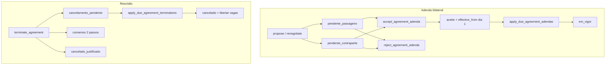

# Plano: §22 Renegociação Bilateral, Rescisão e Hardening

## Diagnóstico (estado live)

| Peça                                                                                                                     | Hoje                                                                                       | Gap                                                                            |
| ------------------------------------------------------------------------------------------------------------------------ | ------------------------------------------------------------------------------------------ | ------------------------------------------------------------------------------ |
| `[renegotiate_agreement_pricing](supabase/migrations/20260906120000_audit_gaps_rls_accept_member_ids_adenda_reject.sql)` | Só `driver_id`; estado sempre `pendente_passageiro`; divisor já = `n_passageiros_contrato` | Passageiro não inicia                                                          |
| `[accept_agreement_adenda](supabase/migrations/20260906010000_rpc_idempotency_wave4.sql)` (remoto)                       | Só aceita `pendente_passageiro`                                                            | Não cobre proposta do passageiro                                               |
| `[reject_agreement_adenda](supabase/migrations/20260906120000_audit_gaps_rls_accept_member_ids_adenda_reject.sql)`       | Já trata `pendente_contraparte` (motorista)                                                | Sem `p_idempotency_key`                                                        |
| `terminate_agreement`                                                                                                    | Inexistente                                                                                | Só `[leavePassenger](src/services/AgreementService.js)` (saída imediata 1 pax) |
| `ofertas_capacidade` RLS                                                                                                 | `ofertas_update_proprio` (UPDATE livre)                                                    | Matching pode mentir `vagas_*`                                                 |
| UI `[MyAgreements.jsx](src/pages/MyAgreements.jsx)`                                                                      | Renegociar só motorista; Aceitar/Rejeitar adenda; Sem «Rescindir»                          | Modal §22 em falta                                                             |

Schema `acordos_adendas` live: `created_by` (iniciador), **sem** `iniciador_id`/`contraparte_id` da visão — contraparte deriva-se de `estado` + `driver_id` / `acordos_passageiros`. Manter este modelo (menos migração de colunas).

**IDs de teste:** G13 no repo já é pickup opcional. Cenários visão G13–G15 → **G16 / G17 / G18** em `[MarketplaceAuditScenarios.test.jsx](src/pages/MarketplaceAuditScenarios.test.jsx)`.

## Decisões de produto (fechadas no plano)

1. **RPC de proposta:** generalizar `renegotiate_agreement_pricing` (mesmo contrato JS existente) + criar alias SQL `propose_agreement_adenda(...)` que chama a mesma lógica (alinha visão sem partir clientes).
2. **Estados adenda:** manter snake lowercase actual (`pendente_passageiro`  `pendente_contraparte`  `aceite`  …). Motorista inicia → `pendente_passageiro`; passageiro activo inicia → `pendente_contraparte`. Contraproposta = nova proposta supersede (`superseded_at`) — já parcialmente no renegotiate.
3. **Accept bilateral:** `accept_agreement_adenda` aceita ambos os pendentes; iniciador (`created_by`) nunca aceita; se `pendente_contraparte` só `driver_id`; se `pendente_passageiro` só pax activo.
4. **Rescisão RPC:** `terminate_agreement(p_acordo_id, p_modo text, p_justificativa text, p_idempotency_key uuid)` com `p_modo ∈ ('aviso_previo','consensual','justa_causa')` (mais claro que só boolean; o boolean da visão mapeia-se: `aviso_previo`/`consensual` ≈ não imediato, `justa_causa` ≈ imediato).
5. **Efeito 1:N:** qualquer parte pode pôr o **acordo inteiro** em `cancelamento_pendente` / cancelado (alinhado G15 visão). `leave_passenger` continua para «sair já» de um lugar sem matar o contrato.
6. **Consensual:** 1.ª chamada grava pedido (`rescisao_modo='consensual'`, `rescisao_solicitada_por`); 2.ª pela contraparte (motorista ↔ qualquer pax activo) aplica fim imediato `cancelado` + liberta vagas. Sem 2.ª confirmação, não cancela.
7. **Justa causa MVP:** enum em `p_justificativa`: `faltas_excessivas` (valida >50% dias úteis via `faltas` + `dias_uteis_mes`), `avaria_veiculo`, `seguranca` (aceites com texto obrigatório; sem tabela de provas no MVP — auditável em colunas do acordo).
8. **Pro-rata justa causa:** ajustar `quota_mensal_kz` dos activos proporcionais a dias úteis decorridos no mês (Luanda); libertar `vagas_disponiveis` atomicamente.
9. **Aviso prévio:** estado `cancelamento_pendente`; membros e vagas **mantêm-se**; lazy `apply_due_agreement_terminations` (espelho das adendas) no load de acordos → dia 1 → `cancelado` + recount vagas + passageiros `saiu`.
10. **Matching modeless (Task 4b):** só polish leve em cards de match com `FeedbackAlert` `role="status"` (sem novos modais bloqueantes); sem redesign de mapa nesta epic.
11. **TDD:** Vitest + mock `supabase.rpc` (padrão do repo). Sem pgTAP novo. Smoke SQL pós-migração via Supabase MCP no projecto `boleia` (`fdclrbcgytnuqcrpsevw`).

## Workflow (orquestração)

Ordem **sequencial** (mesmos ficheiros `AgreementService.js` / migração / `MyAgreements.jsx` — não paralelizar escrita).

1. **Spec** — `.specs/features/acordo-pos-acordo-s22/` (`spec.md` + `tasks.md`) via `tlc-spec-driven` (Large).
2. **DB** — migração `supabase/migrations/20260906150000_s22_bilateral_adenda_terminate_vagas.sql` + `apply_migration` MCP.
3. **Services** — TDD em `[AgreementService.test.js](src/services/AgreementService.test.js)` → implementação + `[offlineQueue.js](src/services/offlineQueue.js)`.
4. **UI** — `ui-designer` (UI Skills → Stitch Project Resolution → ecrã modal) → gate → implementer em `MyAgreements` → `ui-qa` + `code-reviewer` (`VERDICT`).
5. **Verifier** — `npm run test:run` + auditoria G16–G18 + regressão PWA/matching.

Papéis: seguir `[.cursor/skills/boleia-agent-loop/orchestrator/SKILL.md](.cursor/skills/boleia-agent-loop/orchestrator/SKILL.md)`. Revisores via `Task`.

---

## Task 1 — Adenda bilateral (DB + service + UI mínima)

**Migração**

- Alterar `renegotiate_agreement_pricing`: remover `IF v_uid <> driver_id`; autorizar driver **ou** pax `activo`; set `estado` conforme iniciador; notificar contraparte; manter divisor `n_passageiros_contrato` e `effective_from` = 1.º dia mês seguinte (`Africa/Luanda`).
- `CREATE OR REPLACE propose_agreement_adenda(...)` → delega para a mesma lógica.
- Alargar `accept_agreement_adenda` para `pendente_passageiro` **e** `pendente_contraparte`.
- `reject_agreement_adenda(..., p_idempotency_key uuid DEFAULT NULL)`.

**JS** (`[AgreementService.js](src/services/AgreementService.js)`)

- Manter `renegotiateAgreementPricing` (agora bilateral).
- Aliases: `proposeAgreementAdenda`, `respondAgreementAdenda(adendaId, accept, options)`.
- Offline: enfileirar RPCs novas / reject com key.

**UI**

- `podeRenegociar = activo && (isMotorista || isPassageiroActivo)`.
- Banner adenda: CTAs Aceitar/Rejeitar também quando `pendente_contraparte` e user = motorista.

**Testes:** G16 (preço intacto até `effective_from`), G17 (reject mantém acordo), unitários propose passageiro → `pendente_contraparte`.

---

## Task 2 — `terminate_agreement`

**Schema `acordos`**

- Colunas: `rescisao_modo text`, `rescisao_solicitada_por uuid`, `rescisao_justificativa text`, `rescisao_effective_on date`, `cancelado_em timestamptz` (nullable).
- Estados permitidos (case-insensitive na app): `activo`  `cancelamento_pendente`  `cancelado`  `cancelado_justificado` (+ legado se existir).

**RPC `terminate_agreement`** (SECURITY DEFINER + idempotency)

- Caller = `driver_id` ou pax activo; acordo `activo` ou (consensual) já com pedido pendente.
- `aviso_previo` → `cancelamento_pendente`, `rescisao_effective_on` = 1.º dia próximo mês; **não** libertar vagas.
- `consensual` → 2 passos como acima.
- `justa_causa` → validar; `cancelado_justificado`; marcar pax `saiu`; recount `vagas_disponiveis`; pro-rata quotas.
- `apply_due_agreement_terminations(p_acordo_id DEFAULT NULL)` — lazy no `getUserAgreements` / `applyDueAdendasBestEffort`.

**JS:** `terminateAgreement(acordoId, { modo, justificativa }, options)` + offline queue.

**Testes:** G18 (aviso → pendente, vagas ocupadas; após apply dia 1 → cancelado + vagas livres).

---

## Task 3 — Hardening `vagas_disponiveis`

- Trigger `BEFORE UPDATE ON ofertas_capacidade`: recalcular  
`NEW.vagas_disponiveis := NEW.vagas_totais - (soma passageiros activos em acordos ligados à oferta com estado activo|cancelamento_pendente)`.
- Impedir `vagas_disponiveis < 0`; opcionalmente impedir redução de `vagas_totais` abaixo da ocupação.
- Teste serviço/SQL: UPDATE client a `vagas_disponiveis=99` não persiste o valor mentiroso (forçado ao cálculo) — documentar no quick/spec.

---

## Task 4 — UI rescisão + modeless

**Design (obrigatório):** UI Skills (`ibelick/baseline-ui`) → Stitch projecto canónico «Boleia Certa» → modal «Rescindir acordo» com 3 opções (copy PT-PT Fitts: CTA destrutivo separado).

- Aviso prévio: texto modeless «continua activa até ao último dia deste mês…».
- Consensual: explica confirmação da contraparte.
- Justa causa: select + campo texto.

Implementar em `[MyAgreements.jsx](src/pages/MyAgreements.jsx)` + componente dedicado `TerminateAgreementModal.jsx` (shadcn Dialog/Button existentes). Feedback offline via `FeedbackAlert` («Aguardando sincronização…»).

Matching: se houver aviso de capacidade/geo nos cards, usar status não-bloqueante (Cooper) — escopo mínimo.

---

## Ficheiros principais

- Novo: `.specs/features/acordo-pos-acordo-s22/spec.md`, `tasks.md`
- Novo: `supabase/migrations/20260906150000_s22_bilateral_adenda_terminate_vagas.sql`
- Edit: `[src/services/AgreementService.js](src/services/AgreementService.js)`, `[AgreementService.test.js](src/services/AgreementService.test.js)`, `[offlineQueue.js](src/services/offlineQueue.js)`
- Edit: `[src/pages/MyAgreements.jsx](src/pages/MyAgreements.jsx)` (+ testes), novo modal
- Edit: `[MarketplaceAuditScenarios.test.jsx](src/pages/MarketplaceAuditScenarios.test.jsx)` (G16–G18)
- Docs: `[AGENTS.md](AGENTS.md)` § estado arquitectura

## Fora de âmbito (explícito)

- Contraproposta com UI de «editar preço da adenda alheia» além de supersede por nova proposta
- Tabelas de evidência de avaria/segurança
- pgTAP / suite integração Postgres multi-JWT (spec `integration-tests` já deferred)
- Commit/push sem pedido explícito

