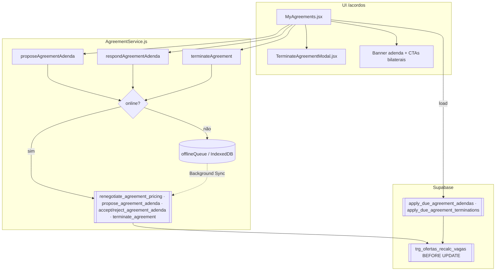

# Epic §22 — Ciclo de Vida Pós-Acordo — Design

**Spec:** `spec.md` · **Tasks:** `tasks.md`
**Estado:** Approved (Task 0) · **T4a Design:** Ready (2026-09-06)

```
VERDICT: APPROVE
ISSUES:
- Mobbin degradado (plano pago) — não bloqueia.
NEXT: T4b implementado; ui-qa + code-reviewer (T5).
```

### Gate design T4a (UI Skills + Stitch)

- **UI Skills:** `ibelick/baseline-ui` consultado *antes* do generate — headings `text-balance`, corpo `text-pretty`, valores `tabular-nums`, acção destrutiva tipo AlertDialog, erros junto da acção, sem gradientes/glow, `z-modal` da escala do repo, alvos ≥48px.
- **Mobbin:** degradado (MCP exigiu plano pago; `standard` / `limit`≤5 / `web`).
- **Stitch projecto canónico:** `8575463146283895778` («Boleia Certa»)
  - Modal rescisão: `a0ecae8f2e4b49188c3014bd4f4a2f39` (`projects/…/screens/a0ecae8f2e4b49188c3014bd4f4a2f39`)
  - Detalhe + CTAs bilaterais: `f809c7c038f346f295c7dd1db36c5aab`
- **shadcn:** reutilizar `Button` (`default` / `destructive` / `outline` / `ghost`). Sem primitivo Dialog no repo — o modal segue o padrão `ConfirmationModal` (`isOpen`, `busy`, `role="dialog"`).
- **Estados:** vazio (sem modo → CTA disabled) · justa causa sem motivo → disabled · loading/`busy` · erro `FeedbackAlert role="alert"` · offline `role="status"` · sucesso modeless.
- **Justa causa:** select mapeado a `RESCISAO_JUSTIFICATIVAS` — **sem** textarea (o serviço só aceita enum) e **sem** preview pro-rata.

---

## Architecture Overview

Tudo o que muta contrato passa por **RPC `SECURITY DEFINER`**. O cliente nunca faz `UPDATE` em `acordos`, `acordos_passageiros` ou `acordos_adendas`. Adenda e rescisão partilham o mesmo padrão já provado no repo: **decisão → estado pendente → aplicação lazy no dia 1**, com fila offline idempotente por cima.



---

## Máquinas de estado

### Adenda (`acordos_adendas.estado`) — snake_case, comparada `lower()`

```
                    ┌──────────────── motorista propõe ──────────────┐
                    ▼                                                │
             pendente_passageiro ──accept(pax activo)──► aceite ──┐  │
                    │                                             │  │
                    └──reject(pax activo)──► rejeitada            │  │
                                                                  │  │
             pendente_contraparte ──accept(driver)────────────────┤  │
                    ▲            └─reject(driver)─► rejeitada     │  │
                    └──────────── passageiro activo propõe ───────┘  │
                                                                     ▼
                          nova proposta ⇒ superseded_at = now()   em_vigor
                                                                (apply_due, dia 1)
```

Constraint já em produção aceita: `pendente_passageiro`, `pendente_contraparte`, `rejeitada`, `cancelada_iniciador`, `aceite`, `em_vigor`. **Não é preciso alterar o CHECK.**

### Acordo (`acordos.estado`)

```
activo ──terminate(aviso_previo)──► cancelamento_pendente ──apply_due (dia 1)──► cancelado
  │                                        │
  │                                        └─ vagas continuam ocupadas até ao dia 1
  ├──terminate(consensual) 1.º passo──► activo (pedido registado)
  │        └── 2.º passo pela contraparte ──► cancelado (imediato, vagas libertadas)
  └──terminate(justa_causa)──► cancelado_justificado (imediato, vagas libertadas)
```

Comparação **sempre case-insensitive** na app (`isActivo`), como já acontece em `MyAgreements`.

---

## Contratos de base de dados

Ficheiro canónico: `supabase/migrations/20260906150000_s22_bilateral_adenda_terminate_vagas.sql`
Aplicação: **Supabase MCP `apply_migration`** no projecto `boleia` (`fdclrbcgytnuqcrpsevw`).

### 1. Colunas novas em `acordos` (S22-TM-01)

| Coluna | Tipo | Nota |
| ------ | ---- | ---- |
| `rescisao_modo` | `text` nullable | `aviso_previo` · `consensual` · `justa_causa` |
| `rescisao_solicitada_por` | `uuid` nullable | quem pediu (auditoria + 2.º passo consensual) |
| `rescisao_justificativa` | `text` nullable | obrigatória em `justa_causa` |
| `rescisao_effective_on` | `date` nullable | 1.º dia do mês seguinte no aviso prévio |
| `cancelado_em` | `timestamptz` nullable | preenchido na transição final |

O CHECK de `acordos.estado` passa a aceitar `activo`, `cancelamento_pendente`, `cancelado`, `cancelado_justificado` (mais os valores legados presentes no remoto — o agente DB confirma antes de recriar a constraint).

### 2. `renegotiate_agreement_pricing` — bilateral (S22-AD-01…05)

Assinatura **inalterada** (não parte o cliente):

```
renegotiate_agreement_pricing(
  p_acordo_id uuid,
  p_modo_preco text,
  p_valor_ask_kz integer,
  p_n_passageiros integer DEFAULT NULL,
  p_idempotency_key uuid DEFAULT NULL
) RETURNS uuid
```

Alterações face à versão live:

- Autorização: `auth.uid() = driver_id` **OU** existe `acordos_passageiros(acordo_id, passenger_id = auth.uid(), estado = 'activo')`. Caso contrário, «Sem permissão para renegociar este acordo.».
- `estado` da adenda derivado do iniciador: motorista → `pendente_passageiro`; passageiro → `pendente_contraparte`.
- Notificação dirigida à **contraparte** (driver quando o iniciador é passageiro; passageiros activos quando é o motorista), com `metadata.adenda_estado` correspondente.
- Mantém: divisor `n_passageiros_contrato`, `effective_from = (date_trunc('month', timezone('Africa/Luanda', now())) + interval '1 month')::date`, snapshot `previo_*`, supersede das pendentes/aceites não aplicadas, registo em `rpc_idempotency`.

### 3. `propose_agreement_adenda` — alias (S22-AD-09)

```
propose_agreement_adenda(
  p_acordo_id uuid, p_modo_preco text, p_valor_ask_kz integer,
  p_n_passageiros integer DEFAULT NULL, p_idempotency_key uuid DEFAULT NULL
) RETURNS uuid
```

Corpo: `RETURN public.renegotiate_agreement_pricing(...)`. Existe para alinhar o vocabulário da visão sem partir clientes antigos.

### 4. `accept_agreement_adenda` — bilateral (S22-AD-06, S22-AD-07)

Assinatura mantida `(p_adenda_id uuid, p_idempotency_key uuid DEFAULT NULL)`. Alteração: a guarda deixa de ser `estado = 'pendente_passageiro'` e passa a:

| `estado` | Quem pode aceitar |
| -------- | ----------------- |
| `pendente_passageiro` | passageiro com `acordos_passageiros.estado = 'activo'` |
| `pendente_contraparte` | `acordos.driver_id` |

Em ambos: `auth.uid() = created_by` ⇒ excepção. Acordo tem de estar `activo`. Depois de marcar `aceite`, chama `apply_due_agreement_adendas` (que só aplica se `effective_from` já chegou).

### 5. `reject_agreement_adenda` — idempotência (S22-AD-08)

```
reject_agreement_adenda(p_adenda_id uuid, p_idempotency_key uuid DEFAULT NULL) RETURNS uuid
```

A lógica de autorização já é bilateral na versão live; só falta o parâmetro de idempotência (com `DEFAULT NULL`, portanto retrocompatível com o cliente actual).

### 6. `terminate_agreement` (S22-TM-02…09)

```
terminate_agreement(
  p_acordo_id uuid,
  p_modo text,                      -- 'aviso_previo' | 'consensual' | 'justa_causa'
  p_justificativa text DEFAULT NULL,
  p_idempotency_key uuid DEFAULT NULL
) RETURNS uuid                      -- acordo_id
```

`SECURITY DEFINER`, `SET search_path TO 'public'`, `FOR UPDATE` no acordo. Fluxo:

1. `auth.uid()` obrigatório; idempotência primeiro (devolve `subject_id` se a chave já existe).
2. Carrega acordo; caller tem de ser `driver_id` ou passageiro activo.
3. `aviso_previo` → exige `activo`; grava modo/solicitante e `rescisao_effective_on = 1.º dia do mês seguinte`; estado `cancelamento_pendente`; **não** mexe em vagas nem em passageiros.
4. `consensual` → se não há pedido `consensual` pendente, grava pedido e devolve (acordo continua `activo`); se há e `auth.uid() <> rescisao_solicitada_por` **e** é contraparte legítima, cancela já (`cancelado`, `cancelado_em`, passageiros `saiu`, recount de vagas).
5. `justa_causa` → `p_justificativa` obrigatória e ∈ `{faltas_excessivas, avaria_veiculo, seguranca}`; se `faltas_excessivas`, valida no servidor >50% dos dias úteis do mês corrente; estado `cancelado_justificado`, passageiros `saiu`, recount de vagas.
6. Notifica a contraparte (`notificacoes.tipo = 'warning'`, `metadata.type = 'agreement_update'`) dentro de `BEGIN … EXCEPTION WHEN OTHERS THEN RAISE WARNING`, como nas RPCs existentes.
7. Grava `rpc_idempotency` no fim.

### 7. `apply_due_agreement_terminations` (S22-TM-04)

```
apply_due_agreement_terminations(p_acordo_id uuid DEFAULT NULL) RETURNS integer
```

Espelho de `apply_due_agreement_adendas`: percorre acordos `cancelamento_pendente` com `rescisao_effective_on <= hoje (Africa/Luanda)`, marca `cancelado` + `cancelado_em`, passa passageiros activos a `saiu` e força recontagem de vagas da oferta. Devolve o número de acordos aplicados.

### 8. Trigger de capacidade (S22-CAP-01…05)

```sql
CREATE FUNCTION public.recalc_vagas_disponiveis() RETURNS trigger ...
CREATE TRIGGER trg_ofertas_recalc_vagas
  BEFORE UPDATE ON public.ofertas_capacidade
  FOR EACH ROW EXECUTE FUNCTION public.recalc_vagas_disponiveis();
```

Cálculo:

```
ocupadas = COUNT(acordos_passageiros ap JOIN acordos a ON a.id = ap.acordo_id
                 WHERE a.oferta_id = NEW.id
                   AND lower(a.estado) IN ('activo','cancelamento_pendente')
                   AND ap.estado = 'activo')
NEW.vagas_disponiveis = NEW.vagas_totais - ocupadas
```

Se `< 0` ⇒ `RAISE EXCEPTION 'Capacidade inconsistente: a oferta já tem mais passageiros do que lugares.'`. O `estado` da oferta (`disponivel`/`parcial`/`cheia`) é derivado do mesmo cálculo para não divergir de `accept_proposal`.

**Risco a validar (A6 da spec):** `accept_proposal` já escreve `vagas_disponiveis`; o trigger recalcula por cima. Como `accept_proposal` insere os `acordos_passageiros` **antes** do `UPDATE` da oferta, o valor do trigger tem de coincidir. Smoke SQL obrigatório antes de fechar a Task 3.

---

## Code Reuse Analysis

| Peça existente | Onde | Como reutilizar |
| -------------- | ---- | --------------- |
| `renegotiate_agreement_pricing` | `supabase/migrations/20260906120000_*.sql` | Base do bilateral — só muda autorização + estado inicial |
| `reject_agreement_adenda` | mesmo ficheiro | Já é bilateral; herda o padrão de guardas |
| `apply_due_agreement_adendas` | mesmo ficheiro | Modelo estrutural de `apply_due_agreement_terminations` |
| `leave_passenger` | migração Wave 3 | Modelo de «marcar `saiu` + recontar vagas + promover waitlist» |
| `rpc_idempotency` | Wave 3 | Tabela de idempotência já existe — não recriar |
| `enqueueRpc` / `isNetworkFailure` | `src/services/offlineQueue.js` | Padrão `queueX()` + `forceQueue` + `navigator.onLine` |
| `leavePassenger` (JS) | `src/services/AgreementService.js` | Template exacto do novo `terminateAgreement` |
| `withPendingAdenda` | `src/services/AgreementService.js` | Continua a expor `adenda_pendente` sem alterações |
| `FeedbackAlert` | `src/components/FeedbackAlert.jsx` | Sucesso/offline `role="status"`, erro `role="alert"` |
| `ConfirmationModal` (prop `busy`) | `src/components/` | Padrão de modal com estado ocupado |
| `resolveAgreementPricing` | `src/utils/resolveAgreementPricing.js` | Preview client-side do preço da adenda |
| `getFriendlyErrorMessage` | `src/utils/errorHandler.js` | Mensagens de erro na UI |
| `computeFaltaDesconto` / dias úteis | `src/utils/faltaDesconto.js` | Referência da regra de dias úteis para espelhar em SQL (A2) |

---

## Componentes

### `AgreementService` (edições)

- **Localização**: `src/services/AgreementService.js`
- **Interfaces** (JSDoc, sem TypeScript):
  - `proposeAgreementAdenda(acordoId, input, options)` — alias explícito de `renegotiateAgreementPricing` (agora bilateral); `input = { modo_preco, valor_ask_kz, n_passageiros? }`.
  - `respondAgreementAdenda(adendaId, accept, options)` — `accept === true` → `acceptAgreementAdenda`; `false` → `rejectAgreementAdenda`.
  - `terminateAgreement(acordoId, { modo, justificativa }, options)` — valida `modo` no cliente (espelho, não substituto da RPC), gera `idempotencyKey`, enfileira em falha de rede.
  - `applyDueTerminationsBestEffort(acordoId?)` — privada, chamada por `getAgreementsForDriver` / `getAgreementsForPassenger` ao lado de `applyDueAdendasBestEffort`.
- **Dependências**: `supabase`, `offlineQueue`, `uuid`.
- **Nota de contrato**: `renegotiateAgreementPricing` faz hoje um `count` de passageiros **activos** para preencher `n_passageiros`, mas a RPC exige coincidência com `n_passageiros_contrato`. Como o passageiro passa a poder propor, o valor por omissão deve vir de `acordos.n_passageiros_contrato` (não do count de activos) — corrigir na Task 1 com teste que prove a diferença.

### `offlineQueue` (edição pontual)

- **Localização**: `src/services/offlineQueue.js`
- **Alteração**: acrescentar `'propose_agreement_adenda'`, `'reject_agreement_adenda'` e `'terminate_agreement'` à união JSDoc de `rpc`. A mecânica (`putQueueItem`, Background Sync, `p_idempotency_key` injectado) mantém-se.

### `TerminateAgreementModal` (novo)

- **Localização**: `src/components/TerminateAgreementModal.jsx`
- **Props**: `{ isOpen, acordo, busy, onConfirm, onCancel }` — `onConfirm({ modo, justificativa })`.
- **Interfaces**: 3 opções em `radiogroup`; textarea obrigatória quando `justa_causa`; CTA destrutivo separado dos neutros; `role="dialog"` + `aria-modal` + `aria-labelledby` (padrão do detalhe em `MyAgreements`).
- **Reusa**: primitivos `src/components/ui/`, tokens de `src/index.css`, `FeedbackAlert`.
- **Design**: obrigatório passar por UI Skills MCP (`ibelick/baseline-ui`) → Stitch (projecto canónico «Boleia Certa») antes de implementar.

### `MyAgreements` (edições)

- **Localização**: `src/pages/MyAgreements.jsx`
- **Alterações**:
  - `podeRenegociar = activo && (isMotorista || isPassageiroActivo)` (hoje é `isMotorista && activo`, linha ~439).
  - Banner de adenda: além do ramo `pendente_passageiro` (linha ~557), tratar `pendente_contraparte` com CTAs para o motorista, e estado «a aguardar resposta» para o criador.
  - Novo CTA «Rescindir acordo» → abre `TerminateAgreementModal`.
  - `offlineQueued` da rescisão → `FeedbackAlert` «Aguardando sincronização…».

---

## Modelo de dados (resumo JSDoc)

```js
/**
 * @typedef {Object} RescisaoInput
 * @property {'aviso_previo'|'consensual'|'justa_causa'} modo
 * @property {'faltas_excessivas'|'avaria_veiculo'|'seguranca'} [justificativa]
 */

/**
 * @typedef {Object} AcordoRescisaoFields
 * @property {string|null} rescisao_modo
 * @property {string|null} rescisao_solicitada_por
 * @property {string|null} rescisao_justificativa
 * @property {string|null} rescisao_effective_on   ISO date
 * @property {string|null} cancelado_em            ISO timestamp
 */
```

---

## Error Handling Strategy

| Cenário | Tratamento | O que o utilizador vê |
| ------- | ---------- | --------------------- |
| Caller sem permissão | `RAISE EXCEPTION` na RPC | `FeedbackAlert type="error"` com mensagem amigável |
| Acordo já cancelado | RPC recusa (ou devolve idempotente) | «Este acordo já não está activo.» |
| Justa causa sem motivo válido | RPC recusa; CTA já desactivado na UI | CTA disabled + erro se forçado |
| Falha de rede | `isNetworkFailure` → `enqueueRpc` | «Aguardando sincronização…» (`role="status"`) |
| Sessão expirada offline | `throw new Error('Sessão necessária …')` | Erro amigável, sem enfileirar |
| Vagas negativas no trigger | `RAISE EXCEPTION` aborta transacção | Erro genérico via `getFriendlyErrorMessage` |
| `apply_due_*` falha na listagem | `console.warn`, best-effort | Lista carrega na mesma |

---

## Tech Decisions

| Decisão | Escolha | Racional |
| ------- | ------- | -------- |
| Modelo de contraparte | Derivar de `estado` + `driver_id` / `acordos_passageiros` | O schema live tem `created_by` mas não `iniciador_id`/`contraparte_id`; evita migração de colunas |
| Modo de rescisão | `text` com 3 valores em vez de boolean «imediato» | Auditável e legível; boolean da visão mapeia-se (`aviso_previo`/`consensual` = diferido, `justa_causa` = imediato) |
| Alias `propose_agreement_adenda` | Delegação, não duplicação | Uma só lógica; vocabulário alinhado com a visão |
| Efeito da rescisão | Acordo **inteiro** | `leave_passenger` continua a cobrir a saída individual |
| Aplicação diferida | Lazy no load (não cron) | Espelha `apply_due_agreement_adendas`; sem infra nova, funciona no plano gratuito |
| Capacidade | Trigger `BEFORE UPDATE` | RLS não consegue validar consistência de valor; o trigger fecha o buraco sem retirar o `UPDATE` legítimo do dono |
| Testes | Vitest + mock `supabase.rpc` | Padrão do repo; pgTAP fica deferred |
