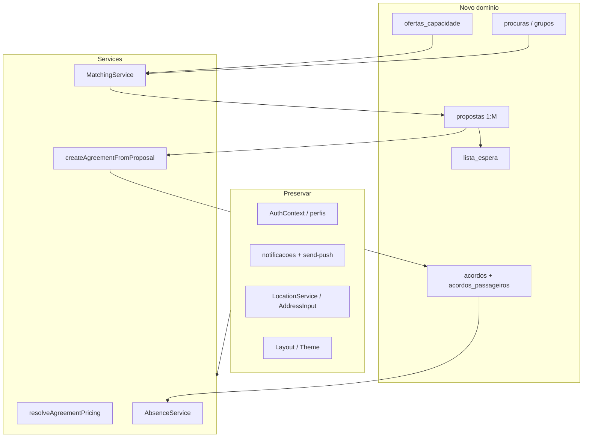
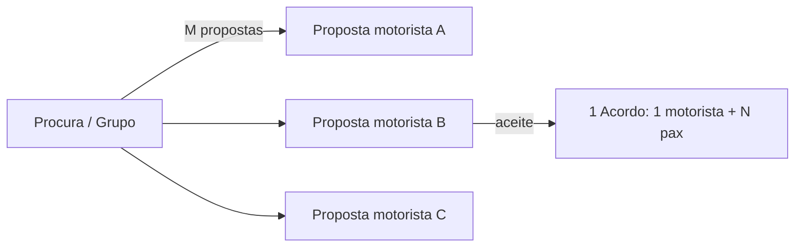
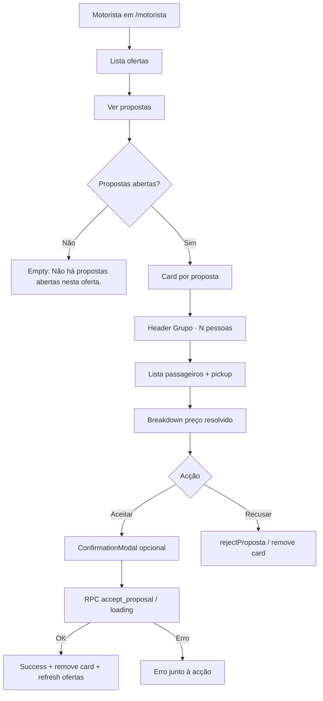
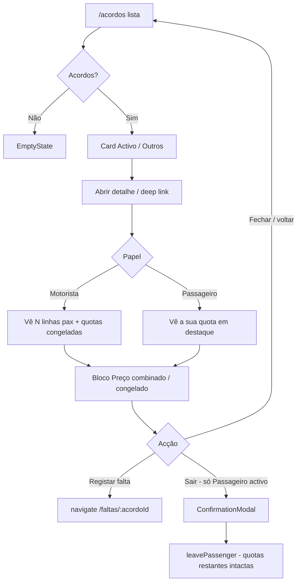
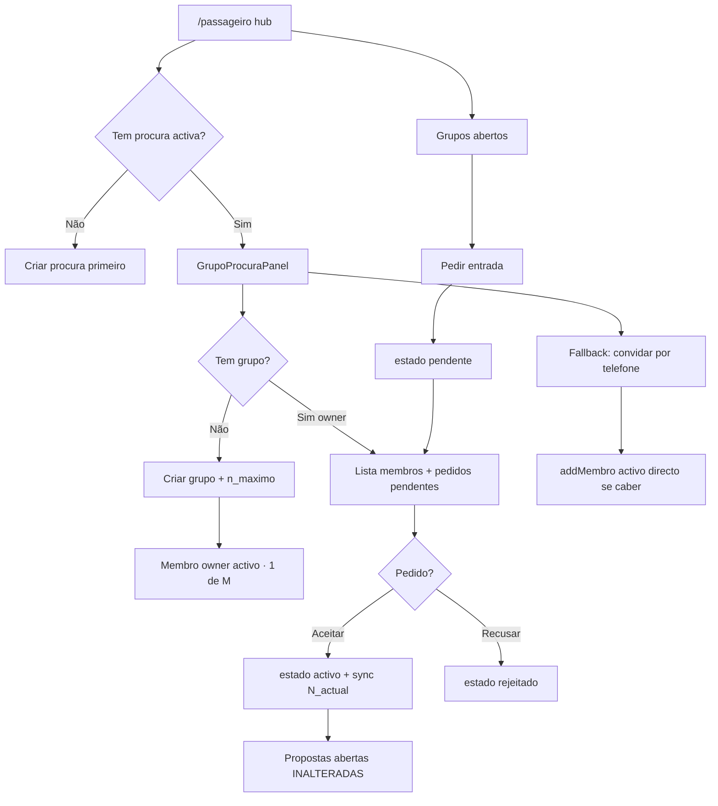
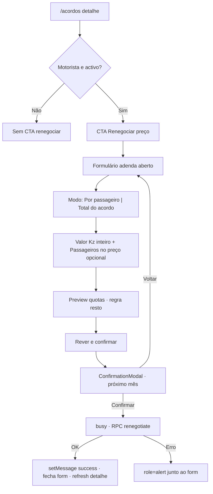
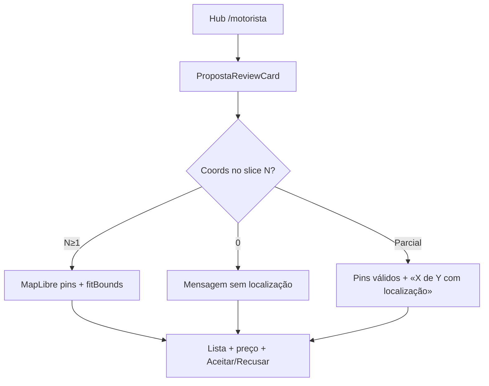

# Marketplace Oferta / Procura — Design

**Spec**: `.specs/features/marketplace-oferta-procura/spec.md`  
**Context**: `.specs/features/marketplace-oferta-procura/context.md`  
**Status**: **Approved** — UI visual = v0 (`v0-reference/`, chat `cYa4j7gxE0p`); lógica de negócio = spec/context/design/planos (prevalecem em conflito)  
**Tasks**: `.specs/features/marketplace-oferta-procura/tasks.md`

---

## Decisão de produto (2026-09-05) — Motorista flexível + propostas bidireccionais

**Não implementar nesta etapa** — só definição. Código de produção intacto até tasks dedicadas.

1. Oferta **fixa** vs **flexível** (sem OD obrigatório na flexível). Flexível ≠ «rota OD + flag».
2. **Sem** zonas/polígonos/raio residencial no MVP. Residência ≠ área de atuação.
3. Matching flexível ajuda a descobrir; motorista decide caso a caso.
4. Propostas **A** (pax→motorista) e **B** (motorista→pax); só a **contraparte** aceita (`created_by` bloqueado).
5. Cadeia: Procura → M propostas → 1 aceite → 1 acordo 1:N (corrigir residual «Procura→Motorista 1:1»).

---

## Architecture Overview

Reconstrução limpa do domínio de negócio sobre a infra existente (Auth, Push, Photon, Layout). Camadas:

1. **Postgres / Supabase** — schema novo + RPC atómica `accept_proposal` + triggers faltas/notificações  
2. **Services (JS + Vitest)** — pricing, matching, ofertas, procuras, propostas, acordos 1:N, waitlist, faltas  
3. **Pages / Components** — substituir dashboards/PublishRoute/MyAgreements/Acordo*; adaptar VehicleSetup e AbsenceTracker  
4. **UI SoT** — v0 (One) + shadcn + UI Skills (+ Mobbin free-safe); Cursor implementa + Visual QA  



**Cardinalidade de negociação (anti-1:1):**



---

## Design Workflow (Penpot-first + exploração v0)

| Fase | Responsável | Entrega | Estado |
|------|-------------|---------|--------|
| A — UX analysis | Cursor | User flows + estados | Feito |
| B — UX structure | Cursor | Inventário | Feito |
| C — Visual | **v0 (One MCP)** → consolidar no Penpot | Protótipo polished 8 vistas | **v0 feito**; Penpot reimport **pendente** (plugin desligado) |
| Gate | Humano | Aprovar visual v0 + reimport Penpot | Em revisão |
| D — Implement | Cursor | TDD → `src/` JSX alinhado a v0/Penpot | Pendente |
| E — Visual QA | Cursor | Browser vs protótipo | Pendente |

### Porquê v0 nesta iteração

Os boards Penpot iniciais eram wireframes com jargon técnico — rejeitados. Foi aplicado `design-first-ui-prompting` e gerado um protótipo no **v0** (`v0-pro`) via MCP One.

**Referência canónica actual da UI:**

- Chat: https://v0.app/chat/cYa4j7gxE0p  
- Código: `.specs/features/marketplace-oferta-procura/v0-reference/`  
- Preview: https://boleia-certa-marketplace-mobile-ui.v0.build  

**Penpot** continua a fonte de verdade do design system do projecto: assim que o plugin estiver ligado, **substituir** os boards `MKT — *` pelos padrões do v0 (copy humana, hierarquia, chips, rotas).

### Regras de copy (obrigatórias — do v0)

- «Por passageiro» / «Total do acordo»
- «3 lugares disponíveis», «Grupo · 3 pessoas», «4 ofertas compatíveis»
- «120.000 Kz», «40.000 Kz / pessoa»
- **Proibido na UI:** `N_actual`, `N_proposto`, `N_candidato`, `N_contrato`, `N_activos`, `POR_PASSAGEIRO`, `TOTAL_ACORDO`, `modo_preco`, `ask`

### Vistas v0 (screen switcher)

1. As minhas ofertas  
2. Publicar oferta  
3. A minha procura  
4. Ofertas compatíveis  
5. Lista de espera  
6. Rever proposta  
7. Acordos  
8. Detalhe do acordo  

### baseline-ui (aplicar na implementação)

- `text-balance` em títulos; `text-pretty` em body  
- Sem gradients roxos / glow  
- Um accent (`#10B748`); `h-dvh` não `h-screen`  
- Skeleton em loading; erros junto à acção  

---

## Penpot Inventory (SoT — parcialmente obsoleto)

**Ficheiro:** `Novo Ficheiro 1`  
**Estado:** tokens/cores/componentes base OK; **14 boards wireframe obsoletos** (substituir após reabrir MCP).  
**Font / frame:** Plus Jakarta Sans · 390×844  

### Cores / tokens / componentes library

Mantidos: primary `#10B748`, set `boleia`, `PrimaryButton`, `SecondaryButton`, `PageHeader`, `OfertaCard`, `ProcuraCard`, `AcordoCard` — **actualizar visual** para match v0 na reimportação.

---

## Code Reuse Analysis

### Preservar / reutilizar

| Artefacto | Location | Uso |
|-----------|----------|-----|
| Auth | `AuthContext.jsx`, `ProtectedRoute`, `Auth.jsx` | Sessão; `tipoPerfil` |
| Shell | `Layout.jsx`, Theme, `PageShell`, `PageHeader`, `EmptyState`, `LoadingSkeleton` | Shell mobile |
| Geo | `LocationService`, `useAutocomplete`, `AddressInput`, `AutocompleteDropdown` | OD / pontos membros |
| Push | `NotificationBell`, `useNotifications`, `usePushNotifications`, `sw.js`, Edge `send-push` | Novos `type`s metadata |
| Modais | `ConfirmationModal`, padrão `isOpen` + callbacks | Confirmar aceite / saída |
| Utils | `errorHandler`, `formatKwanza`, `validation`, `cn` | Erros e Kz |
| Faltas UI | `AbsenceTracker`, `LogAbsenceModal` | Adaptar a acordo 1:N |
| Veículo | `VehicleSetup`, `ProfileService.getVehicle/updateVehicle` | `capacidade_total` / `vagas_passageiros` |
| Deep link | `notificationRouter.js` | Novos types; manter `/acordos?openAcordoId=` |

### Substituir / eliminar

| Artefacto | Motivo |
|-----------|--------|
| `RouteService` / `publishRoute` | → `OfertaService` |
| `AgreementsService.requestSeat` + joins `routes` | → propostas + `createAgreementFromProposal` |
| `PassengerDashboard` / `DriverDashboard` / `PublishRoute` / `MyAgreements` | Domínio legado |
| `AcordoCard*`, `AcordoDetailsModal`, `AcordoKebabMenu` | Acoplados a `acordo.routes.*` |
| BD `routes`, RPCs seats ±1, trigger faltas `/4` | Corte limpo |

### Integration points

| Sistema | Método |
|---------|--------|
| Supabase | Migração MCP única; RLS novas tabelas; não tocar RLS perfis/push excepto refs a `routes` |
| Photon | Sem alteração; matching usa lat/lng já resolvidos |
| Sentry | Mantém-se via `main.jsx` |

---

## Data Models

Tipagem em JSDoc no código (sem TypeScript). Campos conceptuais:

### `veiculos` (ALTER)

- `capacidade_total` (int) — lugares do carro incl. motorista  
- `vagas_passageiros` = `capacidade_total - 1` — **só capacidade**, nunca preço  
- Remover ambiguidade de `lugares_disponiveis`  
- Preservar UNIQUE `id_motorista`

### `ofertas_capacidade`

- `id`, `driver_id`, `veiculo_id`
- `vagas_totais`, `vagas_disponiveis` (≥ 0)
- `modo_preco`: `POR_PASSAGEIRO` | `TOTAL_ACORDO`
- `valor_mensal_ask_kz` (int)
- `flexibilidade_rota` (`false` = **fixa**; `true` = **flexível**)
- `dias_semana`, horário / janela
- `estado`: `inactiva` | `disponivel` | `parcial` | `cheia`
- **Fixa:** `origin_*` / `destination_*` obrigatórios
- **Flexível:** OD **opcional/ausente** — MVP **não** usa zonas, polígonos nem raio residencial; residência do motorista ≠ área de atuação

### `procuras` / `grupos` / `membros_grupo`

- Procura âncora; grupo opcional = **procura colectiva viva**
- `N_actual` = COUNT membros activos (coluna `n_candidato` em sync)
- `n_maximo` = capacidade pretendida pelo criador (grupo continua aberto e negociável enquanto `N_actual < n_maximo`)
- Pontos preferenciais por membro; OD/horários/dias na procura
- **Sem** preço próprio obrigatório no grupo — preço na oferta/proposta do motorista
- Descoberta pública + pedido de entrada (telefone = fallback transitório)

### `propostas`

- `oferta_id`, `procura_id` e/ou `grupo_id`
- `created_by` — iniciador; **não** pode aceitar/rejeitar a própria proposta
- Sentido **A** (passageiro/grupo→motorista) ou **B** (motorista→passageiro/grupo)
- `modo_preco`, `valor_mensal_ask_kz`, `n_passageiros_propostos` (= **`N_proposto`** snapshot de `N_actual` no instante da criação — **não** mutar se o grupo crescer)
- `estado`: `aberta` | `aceite` | `rejeitada` | `invalidada` | `cancelada`
- Uma procura pode ter **M** propostas abertas (qualquer sentido)
- Entrada de membro **não** invalida propostas abertas; renegociação com outro N = **nova** proposta
- Aceitação: incluir primeiros `N_proposto` membros por `ordem_insercao` se `N_actual > N_proposto`

### `acordos` + `acordos_passageiros`

**Cabeçalho:** `oferta_id`, `procura_id`/`grupo_id`, `driver_id`, `modo_preco`, `n_passageiros_contrato`, `valor_mensal_total_kz`, `valor_mensal_por_passageiro_kz` (= `base` no TOTAL), `dias_uteis_mes`, cláusulas contrato, `estado`  
**Sem** `passenger_id` no cabeçalho.

**Linhas:** `acordo_id`, `passenger_id`, `quota_mensal_kz`, pontos acordados, `estado` (`activo` | `saiu` | …), `ordem_insercao` (0…N-1) para regra de resto

### `lista_espera`

- `oferta_id` + procura/grupo; não consome vaga; promoção = notificação

### `faltas`

- `acordo_id`, opcional `passenger_id`, `viagem`, `desconto_kz` via trigger lendo cabeçalho congelado / `dias_uteis_mes`

---

## Pricing Algorithm (MKT-04)

```js
/**
 * @param {{ modo_preco: 'POR_PASSAGEIRO'|'TOTAL_ACORDO', valor_ask_kz: number, n_passageiros: number }} input
 * @returns {{
 *   valor_mensal_total_kz: number,
 *   valor_mensal_por_passageiro_kz: number,
 *   quotas: number[]  // length N; sum === total
 * }}
 */
```

**POR_PASSAGEIRO:**  
`individual = valor_ask_kz`; `total = individual * N`; `quotas = Array(N).fill(individual)`.

**TOTAL_ACORDO:**  
`T = valor_ask_kz`; `base = Math.floor(T / N)`; `resto = T % N`;  
`quotas[i] = i < resto ? base + 1 : base` (i = ordem de inserção);  
cabeçalho `valor_mensal_por_passageiro_kz = base`; `valor_mensal_total_kz = T`.

Testes obrigatórios: 120000/4; 100000/3; 100001/3; N=1; rejeitar N&lt;1.

---

## Matching MVP (MKT-09)

Constantes (`src/utils/matchingConfig.js` ou similar):

| Parâmetro | Default | Notas |
|-----------|---------|-------|
| `MATCH_TIME_TOLERANCE_MINUTES` | `15` | ± minutos (oferta fixa e flexível) |
| `MATCH_RADIUS_ORIGIN_METERS` | `2500` | haversine; **só oferta fixa** |
| `MATCH_RADIUS_DESTINATION_METERS` | `2500` | **só oferta fixa** |

### Oferta fixa (`flexibilidade_rota = false`)

Regras (todas AND para aceite directo):

1. `|hora_oferta - hora_procura| ≤ tolerância` (mesmo dia-da-semana relevante)  
2. distância origem ≤ raio origem  
3. distância destino ≤ raio destino  
4. `N_actual ≤ vagas_disponiveis`

Se 1–3 ok mas 4 falha → elegível waitlist.

### Oferta flexível (`flexibilidade_rota = true`)

- **Não** exige OD na oferta; **não** aplica raio residencial nem polígonos/zonas.
- Critérios MVP: janela/horário + dias + capacidade (`N_actual ≤ vagas`); matching **ajuda a descobrir**, não impõe zona.
- Motorista decide caso a caso se a procura é conveniente (pode aceitar Talatona vivendo em Viana, etc.).
- APIs: `findCompatibleOfertas(procura)` **e** `findCompatibleProcuras(ofertaFlex)` (sentido descoberta B).

**Fora do MVP:** OSRM, Google Directions, ETA, path snapping, polígonos, zonas, raio a partir da residência do motorista.

Haversine: helper puro em `src/utils/geo.js` (TDD) — não depende de Photon.

---

## Components & Services

### `resolveAgreementPricing` — `src/utils/resolveAgreementPricing.js` (ou services)

- **Purpose:** Resolver totais/quotas na aceitação/negociação  
- **Reuses:** nada legado; testes dedicados  

### `MatchingService` — `src/services/MatchingService.js`

- `findCompatibleOfertas(procura|grupo)` → lista filtrada (fixas: geo+tempo; flexíveis: tempo/dias/capacidade)  
- `findCompatibleProcuras(oferta)` → para motorista flexível descobrir procura/grupo (sem filtro residência)  
- Depende: ofertas/procuras activas, `matchingConfig`, `geo`  

### `OfertaService` — `src/services/OfertaService.js`

- CRUD oferta; deriva `vagas_totais` do veículo; estados `disponivel|parcial|cheia`  
- Fixa: validar OD; Flexível: **não** exigir OD; **não** gravar/usar zona residencial  

### `ProcuraService` / `GrupoService`

- Criar procura; gerir membros; sync `N_actual`; **não** invalidar propostas abertas só porque `N_actual` mudou  

### `PropostaService`

- Criar proposta sentido **A** ou **B** (`created_by` = iniciador)  
- Listar M propostas por procura **e** por oferta (inbox contraparte)  
- Rejeitar / aceitar só via contraparte (serviço + RPC)  

### `AgreementService` (substitui canónico de `requestSeat`)

- `createAgreementFromProposal(propostaId)` → chama RPC `accept_proposal`  
- RPC SHALL recusar se `auth.uid() = created_by`  
- `leavePassenger(acordoId, passengerId)` → vagas; **assert** preços intactos  
- `renegotiateAgreementPricing` (P2)  
- Agent discretion: ao aceitar, **cancelar** outras propostas `aberta` da mesma procura/grupo  

### `WaitlistService`

- `enqueue`, `notifyOnVacancy` (só notificação)  

### `AbsenceService` (adaptar)

- Trigger BD: `desconto = valor_mensal_por_passageiro_kz / dias_uteis_mes`  
- Remover qualquer `/ 4`  

### UI pages (gate Penpot — telas em `01 — Marketplace`)

| Path | Board Penpot | Substitui |
|------|--------------|-----------|
| `/publicar-trajeto` | MKT — Publicar Oferta | `PublishRoute` |
| `/motorista` | MKT — Motorista Hub (+ Aceitar Proposta) | `DriverDashboard` |
| `/passageiro` | MKT — Passageiro Hub / Matches / Waitlist / Empty | `PassengerDashboard` |
| `/acordos` | MKT — Acordos / Acordo Detalhe | `MyAgreements` |
| `/veiculo` | MKT — Veículo | adaptar `VehicleSetup` |
| `/faltas` | MKT — Faltas / Falta Registo | adaptar `AbsenceTracker` |

Reutilizar no código: `PageShell`, `PageHeader`, `EstadoBadge`, `ConfirmationModal`, `AddressInput`, `EmptyState`, `LoadingSkeleton`. Novos só se o Penpot exigir variante sem equivalente.

---

## RPC `accept_proposal` (atómica)

1. `SELECT … FOR UPDATE` na oferta  
2. Recalcular `vagas_ocupadas` / `vagas_disponiveis`  
3. Se `n_passageiros_propostos > vagas_disponiveis` → erro / waitlist (não insert parcial)  
4. Resolver pricing (`resolveAgreementPricing` espelhado em SQL ou valores já na proposta)  
5. INSERT acordo + N `acordos_passageiros` com `quota_mensal_kz` e `ordem_insercao`  
6. UPDATE `vagas_disponiveis`; estado oferta `parcial`/`cheia`  
7. Marcar proposta `aceite`; cancelar outras abertas da mesma procura (discretion)  
8. Trigger notificações (N passageiros + motorista) via pipeline push existente  

---

## Migration Strategy (corte limpo)

Ordem sugerida (uma migração ou sequência MCP sem dual-write):

1. TRUNCATE/DROP dependentes: `faltas` → `acordos` → `routes`  
2. DROP RPCs seats, funções/triggers legados (`handle_falta_desconto` com `/4`, notif antiga `route_id`)  
3. ALTER `veiculos`  
4. CREATE tabelas novas + índices + RLS  
5. CREATE RPC `accept_proposal` + triggers faltas/notif  
6. Verificação: `handle_new_user` / RLS perfis / push intactos  

Preservar checklist do plano de impacto (não apagar auth/push/VAPID).

---

## User Flows & States (fase A — pré-Penpot)

### Motorista — publicar oferta

Estados: form vazio → validação coords → loading → sucesso / erro RLS|rede.  
Negócio: sem veículo / vagas_passageiros &lt; 1 → bloquear.

### Passageiro — procura + match

Estados: sem procura → criar → lista matches (vazio compatível) → proposta / waitlist.  
Negócio: `N_candidato > vagas` → CTA waitlist.

### Aceitar proposta

Estados: revisão N pontos → confirmar → loading RPC → acordo criado / overbooking / erro.  

### Acordo activo — saída / faltas

Estados: lista N pax → sair (confirm) → quotas intactas; registar falta → desconto referência `base`.

---

## Error Handling

| Cenário | Handling | UI |
|---------|----------|-----|
| Overbooking RPC | throw mensagem PT | feedback local / notification |
| Proposta invalidada (N mudou) | throw | pedir nova proposta |
| Offline / RLS | `getFriendlyErrorMessage` | erro amigável |
| Geo Photon falha | `LocationService` devolve `[]` | empty autocomplete |

---

## Tech Decisions

| Decision | Choice | Rationale |
|----------|--------|-----------|
| Arredondamento | Resto em `ordem_insercao` | Spec: soma exacta = T |
| Raio default | 2500 m OD | Discretion; Luanda; configurável |
| Ao aceitar proposta | Cancelar outras abertas da mesma procura | Evita dois acordos para a mesma procura |
| Pricing puro JS + espelho SQL na RPC | Testável no Vitest; BD garante atomicidade | TDD Akita |
| Matching sem routing | Haversine + tempo | Spec MVP |
| UI | Penpot gate | AGENTS.md |
| Sem TypeScript | JSDoc | `.cursorrules` |

---

## Requirement → Design mapping

| ID | Design coverage |
|----|-----------------|
| MKT-01 | OfertaService + schema ofertas + UI pós-Penpot |
| MKT-02 | Procura/Grupo services + schema |
| MKT-03 / MKT-18 | RPC accept + Proposta 1:M |
| MKT-04 | resolveAgreementPricing + resto |
| MKT-05 | leavePassenger asserts |
| MKT-06 | fórmula vagas + RPC |
| MKT-07 | trigger faltas |
| MKT-08 | WaitlistService |
| MKT-09 | MatchingService + matchingConfig |
| MKT-10 / 11 / 12 | migração + RLS + notif |
| MKT-13 | renegotiate P2 |
| MKT-14 | App.jsx + notificationRouter |
| MKT-15 | mapa N pontos P3 |
| MKT-16 | AGENTS.md pós-schema |
| MKT-17 | três Ns em todo o código/docs |

---

## Open before Tasks

1. **Tu:** abrir https://v0.app/chat/cYa4j7gxE0p e validar as 8 vistas (aprovar ou pedir ajustes).  
2. **Reabrir Penpot MCP** → reimportar boards a partir do v0 (descartar wireframes com jargon).  
3. Aprovar Design → `tasks.md` (MKT-*).

---

## T24 — Hub motorista: rever proposta multi-passageiro

**Task:** T24 (MKT-03) · **Gate design:** Ready for Implementer  
**Path UI:** `/motorista` → `DriverDashboard.jsx` secção «Rever propostas»  
**Accept path (já existe):** `createAgreementFromProposal` → RPC `accept_proposal`

### Gap actual (código)

O hub lista ofertas e propostas abertas com contagem + ask + Aceitar/Recusar. **Falta:** lista de passageiros cobertos pelo snapshot, pontos de pickup, e **preço resolvido** via `resolveAgreementPricing` (preview), com copy humana.

### User flow



1. Motorista abre oferta → «Ver propostas».  
2. Para cada proposta `aberta`: vê composição do snapshot (`n_passageiros_propostos`) — primeiros N membros por `ordem_insercao` (grupo vivo; **nunca** «grupo incompleto»).  
3. Vê preço resolvido (labels humanas + Kz).  
4. Aceitar → RPC atómica (já wired); Recusar → `rejectProposta`.

### Estados UI

| Estado | UI |
|--------|-----|
| **Empty** (sem propostas na oferta) | Texto: «Não há propostas abertas nesta oferta.» — sem CTA extra (já tem «Publicar oferta» no header) |
| **Loading** (lista ofertas / propostas / membros) | `LoadingSkeleton` estrutural (baseline-ui); botões Aceitar/Recusar `disabled` + `busyId` |
| **Error** | Banner/`role="alert"` junto à secção de acção (`getFriendlyErrorMessage` / mensagem RPC PT) |
| **Success** (aceite) | «Proposta aceite. Acordo criado.» (emerald); card removido; ofertas refresh (vagas) |
| **Busy** (aceitar/recusar) | Ambos CTAs disabled no card activo; sem double-submit |
| **Confirmação** (recomendado) | `ConfirmationModal` antes de Aceitar (acção irreversível — baseline-ui AlertDialog) |

### Composição do card (ordem visual)

1. **Cabeçalho:** chip «Nova» (opcional) + título humano  
   - Grupo: «Grupo · 2 pessoas»  
   - Procura solo: «1 passageiro» / «2 passageiros»  
2. **Lista passageiros** (snapshot): avatar iniciais · nome · pickup opcional (`MapPin` + texto curto)  
3. **Separator**  
4. **Preço resolvido** (ver regras abaixo)  
5. **CTAs:** primary «Aceitar proposta» · secondary «Recusar»

### Regras de display de preço (`resolveAgreementPricing`)

Preview client-side antes do RPC (não muta BD):

```js
resolveAgreementPricing({
  modo_preco: proposta.modo_preco,       // interno; UI não mostra o enum
  valor_ask_kz: proposta.valor_mensal_ask_kz,
  n_passageiros: proposta.n_passageiros_propostos,
})
```

| Modo interno | Labels UI | O que mostrar |
|--------------|-----------|---------------|
| `POR_PASSAGEIRO` | «Por passageiro» | Ask / pessoa · Total = ask × N (`valor_mensal_total_kz`) |
| `TOTAL_ACORDO` | «Total do acordo» | Total = ask · «Por passageiro» ≈ `valor_mensal_por_passageiro_kz` (base) · se `T % N ≠ 0`, nota humana: primeiros passageiros (por ordem) pagam +1 Kz para fechar o total exacto; opcionalmente listar `quotas[i]` por linha |

- Sempre **Kz** + `tabular-nums` + `formatKwanza`.  
- **Proibido na UI:** `N_actual`, `N_proposto`, `N_candidato`, `POR_PASSAGEIRO`, `TOTAL_ACORDO`, `modo_preco`, `ask`.

### Copy samples (PT-PT)

- «Rever propostas»  
- «Grupo · 3 pessoas»  
- «Ponto de encontro: Talatona, perto do Condo»  
- «Total do acordo» → «120.000 Kz»  
- «Por passageiro» → «40.000 Kz / pessoa»  
- «Alguns passageiros pagam 33.334 Kz e outros 33.333 Kz para o total fechar exacto.» (só se resto ≠ 0)  
- «Aceitar proposta» / «Recusar»  
- «Proposta aceite. Acordo criado.»  
- «Não há propostas abertas nesta oferta.»

### Componentes

| Peça | Fonte | Notas |
|------|-------|-------|
| Shell / header / empty / skeleton | `PageShell`, `PageHeader`, `EmptyState`, `LoadingSkeleton` | Já no hub |
| Card content | Tailwind section actual **ou** `@shadcn/card` | Preferir tokens existentes; add se necessário |
| CTAs | `src/components/ui/button.jsx` (já) | `default` / `secondary` |
| Chip estado | Badge shadcn **ou** chip Tailwind actual | `npx shadcn@latest add @shadcn/badge` |
| Lista pax | Avatar shadcn (opcional) + Lucide `MapPin` | `npx shadcn@latest add @shadcn/avatar` |
| Separador preço | `@shadcn/separator` (opcional) | `npx shadcn@latest add @shadcn/separator` |
| Confirmar aceite | `ConfirmationModal` | Já no repo |
| Pricing | `resolveAgreementPricing` + `formatKwanza` | Preview only |
| Dados membros | `listMembrosGrupo` (+ slice primeiros N) | Via `grupo_id` da proposta |

**shadcn add (se faltar no repo):**  
`npx shadcn@latest add @shadcn/card @shadcn/badge @shadcn/separator @shadcn/avatar`  
Hoje só `button` existe em `src/components/ui/` — reutilizar padrões Tailwind do hub se o Implementer preferir não instalar todos.

### Dados / composição snapshot

- `proposta.n_passageiros_propostos` = N do contrato previsto.  
- Membros: `listMembrosGrupo(grupo_id)` ordenados por `ordem_insercao` → **slice(0, N)**.  
- Se `N_actual > N` (grupo cresceu): mostrar só os N cobertos; copy neutra (ex. «Passageiros neste acordo») — **nunca** «grupo incompleto».  
- Se `N_actual < N` na revisão: ainda mostrar aviso suave de que a aceitação pode falhar (RPC) — sem jargon.

### Referências de design

| Fonte | Resultado |
|-------|-----------|
| **UI Skills** | `ibelick/baseline-ui` — `text-balance`/`text-pretty`, skeletons, erro junto à acção, AlertDialog p/ irreversível, `tabular-nums`, um accent `#10b748`, sem glow/purple |
| **Mobbin** | **Falhou** (plano free / paid required) — degradado; não bloqueia |
| **v0 marketplace (canónico)** | Chat https://v0.app/chat/cYa4j7gxE0p · vista **6. Rever proposta** · código `.specs/features/marketplace-oferta-procura/v0-reference/` |
| **v0 T24 (refino multi-pax)** | Chat https://v0.app/chat/tLT9dcf4coN · Create async (`v0-pro`, msg `cFoHsCeYHPwNQd530OBim4QcPJNq8NDK`) — briefing multi-pax + pickup + pricing; geração pode ainda estar a correr; **SoT visual imediato** = vista 6 de `cYa4j7gxE0p` + esta secção. **Sem** deploy Vercel |
| **shadcn** | Button (local) · Card/Badge/Separator/Avatar (@shadcn registry) |

### Implementer checklist (após este gate)

1. TDD: testes do card/secção com lista membros + preview pricing (incl. TOTAL resto).  
2. Estender `DriverDashboard` (ou extrair `PropostaReviewCard.jsx`) sem reinventar Accept RPC.  
3. Copy humana only; mapear enums só no código.  
4. Visual QA vs v0 `cYa4j7gxE0p` + chat T24 `tLT9dcf4coN`.

---

## T28 — Detalhe acordo 1:N (lista passageiros + preço congelado)

**Task:** T28 (MKT-03) · **Gate design:** Ready for Implementer  
**Path UI:** `/acordos` → `MyAgreements.jsx` (lista + painel/detalhe)  
**Deps:** T18, T24 · **Não tocar:** `AgreementService` mutações novas / `PublishRoute` (outros agentes)

### Gap actual (código)

`MyAgreements` já tem lista activos/outros, deep link `?openAcordoId=`, sheet de detalhe, CTA «Registar faltas» e «Sair do acordo» + `ConfirmationModal`. **Falta alinhar ao v0 (vista 8):**

| Gap | Hoje | Alvo T28 |
|-----|------|----------|
| Badge preço | Ausente | Bloco «Preço combinado» + texto «congelado» + valor Kz |
| Lista pax | `passenger_id` truncado · todos os estados misturados | Avatar/iniciais · **nome** · estado humano · `quota_mensal_kz` |
| Vista por papel | Mesma UI | Motorista: **N linhas** do contrato; Passageiro: destaque da **sua** quota (lista completa opcional só se dados já vierem) |
| Hierarquia | Sheet mínimo (estado + contagens) | Cabeçalho rota + horário + bloco congelado + secção «Passageiros · N» + CTAs |
| Copy | «Passageiros no contrato» (ok) mas IDs crus | Sem jargon (`N_contrato`, `POR_PASSAGEIRO`, etc.) |

### User flow



1. Utilizador abre `/acordos` (ou deep link `openAcordoId`).  
2. Toca num card → detalhe (sheet actual ou painel alinhado v0 — **mesmo path**, sem rota nova).  
3. **Motorista:** secção «Passageiros · N» com **uma linha por** `acordos_passageiros` do contrato (`n_passageiros_contrato` / linhas persistidas); cada linha mostra nome + estado («Confirmado/a» / «Saiu») + `quota_mensal_kz` em Kz.  
4. **Passageiro:** bloco de preço mostra a **sua** `quota_mensal_kz`; na lista, a sua linha fica visualmente destacada (ex. borda/accent); linhas de outros pax só se o payload já as incluir — sem pedir dados extra fora do serviço actual.  
5. Badge/bloco «Preço combinado»: explica que o valor **fica congelado** (invariante MKT-05 — saída **não** recalcula quotas).  
6. CTAs: «Registar falta» → `/faltas/:acordoId`; «Sair do acordo» (só Passageiro + estado activo) → modal → sucesso «A quota do mês mantém-se.»

### Estados UI

| Estado | UI |
|--------|-----|
| **Loading** | `LoadingSkeleton` na lista; detalhe não abre até dados prontos (ou skeleton no sheet) |
| **Vazio** (sem acordos) | `EmptyState`: «Sem acordos» / «Quando aceitares uma proposta, o acordo aparece aqui.» |
| **Erro** | Banner `role="alert"` junto à lista ou ao CTA do detalhe (`getFriendlyErrorMessage` / mensagem PT de `leavePassenger`) |
| **Activo** | Chip «Activo» (emerald); bloco congelado visível; CTAs falta + (pax) sair |
| **Saiu** (linha pax `estado = saiu` ou acordo não activo) | Chip/linha «Saiu» (neutro/slate); quota **ainda visível** (histórico congelado); **sem** CTA «Sair»; falta só se regra de negócio permitir no acordo activo |
| **Busy** (sair) | Modal confirm + botões disabled / sem double-submit |
| **Success** (saiu) | «Saíste do acordo. A quota do mês mantém-se.» (emerald); fechar detalhe + refresh lista |

Comparação de estados: **case-insensitive** (`activo` / `Activo`).

### Composição do detalhe (ordem visual — v0 vista 8)

1. **Cabeçalho:** Chip estado · título `Origem → Destino` (`text-balance`) · meta «Desde …» se disponível.  
2. **Card rota:** Partida / Chegada (hora + local) — reutilizar dados de `ofertas_capacidade` quando existirem.  
3. **Bloco «Preço combinado» (obrigatório T28):**  
   - Ícone `ShieldCheck` (Lucide)  
   - Título: **«Preço combinado»**  
   - Body (`text-pretty`): **«O valor fica congelado durante este acordo.»**  
   - Valor em destaque: quota de referência ou a do viewer (`formatKwanza` + `tabular-nums` + **Kz**)  
   - Opcional secundário: «Total do acordo» = `valor_mensal_total_kz` (humano; nunca enum).  
4. **Separator** (shadcn ou `border-t`).  
5. **Secção** label: `PASSAGEIROS · {N}` (N = linhas do contrato / activos + saíram — **nunca** rótulo `N_contrato`).  
6. **Lista:** avatar iniciais · nome · estado humano · quota `X Kz`.  
7. **CTAs:**  
   - Secondary / outline: «Registar falta» (Clock) → `/faltas/:id`  
   - Destructive outline: «Sair do acordo» (só Passageiro + activo)  
   - Ghost: «Fechar»

### Regras de display (Quatro Ns → copy humana)

| Conceito interno | UI |
|------------------|-----|
| `N_contrato` | «Grupo · N pessoas» / «Passageiros · N» / «Individual» se N=1 |
| `N_activos` | Só lotação se necessário («2 activos»); **nunca** para recalcular preço |
| `quota_mensal_kz` | «40.000 Kz» por linha — imutável após aceitação |
| `modo_preco` | Labels «Por passageiro» / «Total do acordo» se mostrar modo; **proibido** `POR_PASSAGEIRO` / `TOTAL_ACORDO` |
| Cabeçalho `valor_mensal_por_passageiro_kz` | «Por pessoa» / valor do bloco congelado (base) |

**Invariante visual:** após «Sair», as quotas das linhas restantes **não mudam** na UI; copy do modal já o diz.

### Copy samples (PT-PT)

- «Detalhe do acordo»  
- «Preço combinado» / «O valor fica congelado durante este acordo.»  
- «Passageiros · 3»  
- «Confirmado» / «Confirmada» / «Saiu»  
- «40.000 Kz» · «120.000 Kz» (total)  
- «Registar falta» / «Sair do acordo» / «Fechar»  
- Modal: «A tua quota deste mês não é reembolsada. Os preços dos restantes passageiros mantêm-se.»  
- Sucesso: «Saíste do acordo. A quota do mês mantém-se.»

### Componentes

| Peça | Fonte | Notas |
|------|-------|-------|
| Shell / header / empty / skeleton | `PageShell`, `PageHeader`, `EmptyState`, `LoadingSkeleton` | Já em `MyAgreements` |
| Card lista / detalhe | Tailwind actual **ou** `@shadcn/card` | Preferir tokens `src/index.css` (`--color-primary` `#10b748`) |
| Chip estado / badge congelado | Chip Tailwind **ou** `@shadcn/badge` | Badge «Preço combinado» = bloco com `ShieldCheck`, não só pill |
| Separator | `@shadcn/separator` ou `border-t` | Entre preço e lista |
| CTAs | `src/components/ui/button.jsx` (já) | `default` / `secondary` / destructive outline |
| Confirmar saída | `ConfirmationModal` | Já wired — baseline-ui AlertDialog pattern |
| Kz | `formatKwanza` | `tabular-nums` |
| Ícones | Lucide `ShieldCheck`, `Clock`, `Users`, `ArrowRight`, `ChevronRight` | Sem Material Symbols |

**shadcn add (se o Implementer instalar):**  
`npx shadcn@latest add @shadcn/badge @shadcn/card @shadcn/separator @shadcn/button`  
Hoje em `src/components/ui/`: só `button.jsx` — reutilizar chips/cards Tailwind do detalhe actual é OK se não quiserem expandir o registry nesta task.

### Layout textual (degradação One refine — SoT imediato)

Base: v0 canónico vista **8. Detalhe do acordo** + gap de `MyAgreements`:

```
[←] Detalhe do acordo
Chip Activo                    Desde …
Talatona → Mutual

┌ Card rota ─────────────────┐
│ Partida 07:15 · Talatona   │
│ Chegada ~07:45 · Mutual    │
│ ┌ Preço combinado ───────┐ │
│ │ 🛡 O valor fica congelado│ │
│ │              40.000 Kz │ │
│ └────────────────────────┘ │
└────────────────────────────┘

PASSAGEIROS · 3
┌────────────────────────────┐
│ AC  Ana Costa   Confirmada │ 40.000 Kz
│ JP  João Pedro  Confirmado │ 40.000 Kz
│ MS  Maria …     Confirmada │ 40.000 Kz
└────────────────────────────┘

[ Registar falta ]
[ Sair do acordo ]   ← só Passageiro + activo
[ Fechar ]
```

Mobile-first `max-w-md`; um accent primary; sem purple/glow; `h-dvh` no shell existente.

### Referências de design

| Fonte | Resultado |
|-------|-----------|
| **UI Skills** | `ibelick/baseline-ui` — `text-balance`/`text-pretty`, skeletons, erro junto à acção, AlertDialog p/ sair, `tabular-nums`, accent único `#10b748`, sem glow/purple |
| **Mobbin** | **Falhou** (plano free / paid required — «Upgrade at mobbin.com/pricing») — degradado; não bloqueia |
| **v0 marketplace (canónico)** | Chat https://v0.app/chat/cYa4j7gxE0p · vista **8. Detalhe do acordo** · `.specs/.../v0-reference/app__page.tsx` (`AgreementDetail`) · preview https://boleia-certa-marketplace-mobile-ui.v0.build |
| **One/v0 refine T28** | Integração v0 **disponível**; **não** se criou chat novo nem deploy Vercel — SoT suficiente = vista 8 + esta secção (padrão T24: refine opcional, SoT imediato = canónico) |
| **shadcn** | Button (local) · Badge/Card/Separator (@shadcn registry, add command acima) |
| **Tokens** | `src/index.css` — `--color-primary: #10b748`, backgrounds light/dark |

### Implementer checklist (após este gate)

1. TDD: detalhe com N linhas (motorista); destaque da quota do passageiro; badge «Preço combinado»; estados activo/saiu; CTA sair não recalcula quotas na UI.  
2. Evoluir **só** UI de `MyAgreements` (e componentes de apresentação se extrair) — **sem** alterar `AgreementService` / RPC / `PublishRoute`.  
3. Nomes reais (join perfil) se já no payload; senão placeholder humano curto — **nunca** UUID truncado como UX final.  
4. Copy humana only; Visual QA vs v0 vista 8 `cYa4j7gxE0p`.

### VERDICT design (T28)

```text
VERDICT: APPROVE
ISSUES:
- (nenhum bloqueante) Mobbin degradado; One refine não gerado — SoT = v0 vista 8 + layout textual acima
NEXT: Implementer T28 (TDD → MyAgreements detalhe) → UI QA + Code Reviewer
```

---

## T31 — Grupo vivo: `n_maximo` + descoberta pública / pedir entrada

**Task:** T31 (MKT-02, MKT-17) · **Gate design:** Ready for Implementer  
**Paths UI:** `/passageiro` → `GrupoProcuraPanel.jsx` + secção descoberta (`GrupoDescobertaPanel` ou equivalente)  
**Deps:** T22 · **Não tocar:** `AgreementService` / waitlist auto-aceitar / invalidar propostas por sync N

### Gap actual (código)

| Gap | Hoje | Alvo T31 |
|-----|------|----------|
| Capacidade pretendida | Sem coluna `n_maximo` | `grupos.n_maximo` (criador define 2–8); UI «Até quantas pessoas?» |
| Label tamanho | «Grupo · N pessoas» | «Grupo · N de M» quando há `n_maximo` (ex. «2 de 4») |
| Entrada | Só telefone (owner adiciona activo) | Fluxo principal: descoberta → **Pedir entrada** → aprovação; telefone = **fallback** |
| Pedidos | Inexistente | `membros_grupo.estado = pendente` → Aceitar / Recusar |
| Descoberta | Inexistente | Lista «Grupos abertos» (`N_actual < n_maximo`, procura activa) |
| Snapshot propostas | syncN não invalida (já) | **Preservar** — aprovar membro **não** muta propostas abertas |

### Schema (DDL — só Supabase MCP)

1. `grupos.n_maximo` `INTEGER NOT NULL DEFAULT 4` + `CHECK (n_maximo BETWEEN 2 AND 8)`.  
2. Expandir check `membros_grupo.estado`: `'activo' | 'saiu' | 'pendente' | 'rejeitado'`.  
3. RLS actual já permite SELECT autenticados + INSERT se `passenger_id = auth.uid()` — suficiente para pedir entrada; UPDATE owner/envolvidos para aprovar.

### User flow



1. Criador define capacidade pretendida ao criar o grupo (`n_maximo`).  
2. Outros passageiros veem grupos com vagas (`n_candidato < n_maximo`) e pedem entrada.  
3. Owner aprova → `N_actual` sobe; propostas abertas **mantêm** `N_proposto`.  
4. Telefone permanece como convite directo (fallback), também sujeito a `n_maximo`.

### Estados UI

| Estado | UI |
|--------|-----|
| **Loading** | Skeleton no painel grupo e na lista «Grupos abertos» |
| **Sem grupo** | Copy vivo + stepper capacidade + CTA «Criar grupo» |
| **Grupo com vagas** | Badge «Grupo · N de M»; lista membros; pedidos (owner); fallback telefone |
| **Grupo cheio** | Badge «Grupo · M de M»; sem pedir entrada / sem add; copy «Grupo completo» |
| **Pedido pendente** (candidato) | Chip «Pedido enviado» no card do grupo; sem double-submit |
| **Erro** | Banner `role="alert"` junto à acção (`getFriendlyErrorMessage`) |
| **Busy** | CTAs disabled |
| **Vazio descoberta** | «Não há grupos abertos nesta altura.» |

### Copy samples (PT-PT)

- «Grupo de viagem» / «Viajas sozinho… mesmo sem o grupo cheio.»  
- «Até quantas pessoas?» / «Criar grupo»  
- «Grupo · 2 de 4»  
- «Grupos abertos» / «Pedir entrada» / «Pedido enviado»  
- «Pedidos de entrada» / «Aceitar» / «Recusar»  
- «Ou convidar por telefone» (secundário)  
- «Este grupo já está completo.» / «Já pediste entrada neste grupo.»  
- Proibido na UI: `N_actual`, `n_maximo` cru, `pendente` técnico sem label humana

### Componentes

| Peça | Fonte | Notas |
|------|-------|-------|
| Painel próprio | `GrupoProcuraPanel.jsx` | Capacidade + pedidos + telefone fallback |
| Descoberta | Novo `GrupoDescobertaPanel.jsx` (ou secção em hub) | Lista + pedir entrada |
| Serviços | `GrupoService.js` | `createGrupo(..., nMaximo)`, `listGruposAbertos`, `pedirEntradaGrupo`, `listPedidosPendentes`, `aprovarEntrada`, `rejeitarEntrada`; `addMembroGrupo` respeita `n_maximo` |
| Shell | `PageShell` / cards Tailwind actuais | Tokens `--color-primary` |
| CTAs | `button.jsx` ou Tailwind primary | Aceitar = primary; Recusar = outline |
| Ícones | Lucide `Users`, `UserPlus`, `Clock`, `MapPin` | |

**shadcn (opcional):** `npx shadcn@latest add @shadcn/badge @shadcn/card` — chips/cards Tailwind existentes são OK se não instalar.

### Layout textual (SoT imediato)

```
── Criar grupo ──
Grupo de viagem
Viajas sozinho… podes propor mesmo sem o grupo cheio.
Até quantas pessoas?   [ 2 ] [ 3 ] [ 4✓ ] … [ 8 ]
[ Criar grupo ]

── Grupo próprio ──
Grupo · 2 de 4
[ membros… ]
Pedidos de entrada
  MS  Maria  [Aceitar] [Recusar]
── Ou convidar por telefone ──
(telefone + Adicionar)

── Grupos abertos ──
┌ Talatona → Mutual · 07:15 ┐
│ Grupo · 2 de 4            │
│ [ Pedir entrada ]         │
└───────────────────────────┘
```

### Referências de design

| Fonte | Resultado |
|-------|-----------|
| **UI Skills** | `ibelick/baseline-ui` — text-balance/pretty, skeletons, erro junto à acção, accent único, sem purple/glow |
| **Mobbin** | **Falhou** (plano free) — degradado; não bloqueia |
| **v0 canónico** | Chat https://v0.app/chat/cYa4j7gxE0p · «Grupo · N pessoas» na vista procura |
| **One/v0 T31** | https://v0.app/chat/jo0mXnLQf42 · SoT = chat + layout textual + canónico |
| **Tokens** | `src/index.css` primary `#10b748` |

### Invariantes (Implementer)

1. `N_proposto` das propostas abertas **não** muda ao aprovar/adicionar membro.  
2. `syncNCandidato` só conta `estado = 'activo'`.  
3. Não bloquear propostas por «grupo incompleto».  
4. Recusar / pendente **não** entra em `N_actual`.  
5. `addMembroGrupo` / `aprovarEntrada` falham se `N_actual >= n_maximo`.

### Implementer checklist

1. DDL MCP → testes serviço (TDD) → UI painel + descoberta.  
2. Actualizar `GrupoProcuraPanel` + hub passageiro; telefone como fallback.  
3. Copy humana; Visual QA vs layout textual / v0 T31.

### VERDICT design (T31)

```text
VERDICT: APPROVE
ISSUES:
- Mobbin degradado (plano free)
- One/v0 chat T31 em curso ou layout textual como SoT imediato
NEXT: Implementer T31 (DDL MCP → TDD GrupoService → UI) → UI QA + Code Reviewer
```

---

## T29 — Adenda / renegotiateAgreementPricing

**ID:** MKT-13 · **Path:** `/acordos` → detalhe em `MyAgreements.jsx` (sem rota nova)  
**API (já fechada):** `renegotiateAgreementPricing(acordoId, { modo_preco, valor_ask_kz, n_passageiros? })`  
**MVP:** valores aplicados de imediato no contrato; **copy** fala «próximo mês» (mês corrente mantém quotas já combinadas; faltas já registadas mantêm `desconto_kz`).

### Quem vê o quê

| Perfil | Acordo | UI |
|--------|--------|-----|
| **Motorista** | `activo` | CTA «Renegociar preço» no detalhe |
| Motorista | cancelado / outro | Sem CTA |
| Passageiro | qualquer | Sem CTA (só vê preço congelado + lista) |

### User flow



1. No detalhe (T28), motorista activo toca «Renegociar preço» → abre secção inline (não navega).  
2. Escolhe modo humano, valor mensal (Kz), opcionalmente «Passageiros no preço» (default = contagem de activos).  
3. Preview actualiza com `resolveAgreementPricing` (cliente) — quotas por pessoa / total; em Total, resto no último.  
4. «Rever e confirmar» abre `ConfirmationModal` com aviso do próximo mês.  
5. Confirm → `busy` no modal → serviço → sucesso local ou erro `role="alert"`.

### Estados UI

| Estado | UI |
|--------|-----|
| **Idle** | Detalhe T28; CTA «Renegociar preço» (só motorista+activo), acima de «Registar falta» |
| **Form open** | Secção «Novo preço» expandida; CTA principal do form «Rever e confirmar»; «Cancelar» fecha |
| **Preview** | Bloco «Como fica» com quotas `tabular-nums` (derivado do form; sem extra fetch) |
| **Busy** | Modal `busy`; CTAs disabled; overlay não fecha |
| **Erro** | Banner `role="alert"` junto ao formulário (`getFriendlyErrorMessage` / mensagem de negócio) |
| **Sucesso** | `setMessage` success no `PageShell`; form fecha; bloco «Preço combinado» reflecte novos valores após refresh |

### Copy samples (PT-PT)

- CTA: «Renegociar preço»  
- Título form: «Novo preço» / subtítulo: «Actualiza o valor combinado do acordo.»  
- Modo: «Por passageiro» · «Total do acordo»  
- Campos: «Valor mensal» (+ sufixo «Kz») · «Passageiros no preço» (hint: «Por omissão: passageiros activos»)  
- Preview: «Como fica» · «Cada um paga X Kz» · «Total Y Kz» · «O resto fica no último» (só Total com resto)  
- Modal título: «Confirmar novo preço?»  
- Modal corpo: «Aplica-se a partir do próximo mês. O mês corrente mantém as quotas já combinadas.»  
- Confirmar / Voltar · Sucesso: «Preço actualizado. Aplica-se a partir do próximo mês.»  
- **Proibido na UI:** `POR_PASSAGEIRO`, `TOTAL_ACORDO`, `modo_preco`, `valor_ask_kz`, `N_contrato`, `N_activos`, `n_passageiros`

### Componentes

| Peça | Fonte | Notas |
|------|-------|-------|
| Página | `MyAgreements.jsx` | Extensão do detalhe T28; estado local form + modal |
| Shell | `PageShell` + `PageHeader` | Feedback `setMessage` existente |
| CTA / acções | `src/components/ui/button.jsx` | Primary = confirmar; secondary/outline = Renegociar; ghost = Cancelar |
| Modal | `ConfirmationModal` (`isOpen`, `busy`) | Confirm **não** vermelho destrutivo — usar primary `#10b748` neste fluxo (ou prop variant se já existir; senão classe local só para adenda) |
| Form | Inline no detalhe | Preferir inputs nativos + Label Tailwind **ou** shadcn abaixo |
| Preview | Bloco Tailwind | Reutilizar tipografia do bloco «Preço combinado» |
| Serviço | `AgreementService.renegotiateAgreementPricing` | Não implementar neste gate |
| Ícones | Lucide `Pencil` / `RefreshCw` (opcional) | `aria-hidden` |

**shadcn (opcional — só se o Implementer precisar de primitivos):**

```bash
npx shadcn@latest add @shadcn/input @shadcn/label @shadcn/radio-group
```

Repo hoje só tem `button.jsx` em `src/components/ui/` — radio/input/label **não** existem localmente; OK usar segmented buttons Tailwind (padrão PublishRoute) sem instalar, ou adicionar JSX via comando acima.

### Layout textual (SoT imediato)

```
── Detalhe acordo (activo · Motorista) ──
Preço combinado                    40.000 Kz
O valor fica congelado…
Total do acordo 120.000 Kz

Passageiros · 3
  MS  Maria   Activo    40.000 Kz
  …

[ Renegociar preço ]     ← primary/secondary, só motorista+activo
[ Registar falta ]
[ Fechar ]

── Form open ──
Novo preço
Actualiza o valor combinado do acordo.

Modo
 (•) Por passageiro   ( ) Total do acordo

Valor mensal
 [ 45000 ] Kz

Passageiros no preço
 [ 3 ]   hint: Por omissão = activos

Como fica
  Cada um paga 45.000 Kz
  Total 135.000 Kz

[ Cancelar ]  [ Rever e confirmar ]

── ConfirmationModal ──
Confirmar novo preço?
Aplica-se a partir do próximo mês.
O mês corrente mantém as quotas já combinadas.
[ Confirmar ]  (busy → disabled)
[ Voltar ]
```

### Referências de design

| Fonte | Resultado |
|-------|-----------|
| **UI Skills** | `ibelick/baseline-ui` — text-balance/pretty, `tabular-nums`, erro junto à acção, AlertDialog para acção irreversível, accent único, sem purple/glow/gradients |
| **Mobbin** | **Falhou** (plano free / paid required) — degradado; não bloqueia |
| **v0 T29 (One)** | https://v0.app/chat/hT2KzrQr0Bt · plano alinhado (form inline + modal + preview); gerou até plan mode — **SoT imediato = layout textual** (+ canónico) |
| **v0 canónico marketplace** | https://v0.app/chat/cYa4j7gxE0p · vista Acordos / preço humano |
| **Tokens** | `src/index.css` primary `#10b748`, Plus Jakarta Sans, `max-w-md` |

### Invariantes (Implementer)

1. Só motorista + acordo activo vê CTA / pode submeter.  
2. Copy «próximo mês» mesmo se MVP grava valores já; leave **não** recalcula.  
3. Preview cliente com a mesma regra de resto que o serviço / RPC.  
4. Sem toast library; sem TypeScript; sem jargon na UI.  
5. Não criar página/rota nova — tudo em `MyAgreements` detalhe.

### Implementer checklist

1. Gate design APPROVE → TDD serviço/RPC (paralelo se já em curso) → UI mínima no detalhe.  
2. Reutilizar `ConfirmationModal` + `Button` + padrões T28.  
3. Visual QA vs layout textual / chat v0 T29.

### VERDICT design (T29)

```text
VERDICT: APPROVE
ISSUES:
- Mobbin degradado (plano free)
- One/v0 Create Chat síncrono timeout; async chat hT2KzrQr0Bt criado — SoT imediato = layout textual + canónico cYa4j7gxE0p
- ConfirmationModal actual usa confirm vermelho (Sair); adenda precisa confirm primary/emerald — variante ou override local
NEXT: Implementer T29 (RPC + renegotiateAgreementPricing TDD → UI MyAgreements) → UI QA + Code Reviewer
```

---

## T30 — Mapa N pontos preferenciais

**ID:** MKT-15 · **P3** · **Path UI:** `/motorista` → `PropostaReviewCard`  
**Deps:** T24 · **Não tocar:** T29 uncommitted, DDL, leave/waitlist/adenda  
**SoT:** v0 https://v0.app/chat/jIH3o5n1EM1 (UI gerada; mock CSS no sandbox → **MapLibre real no repo**) + UI Skills `ibelick/baseline-ui` + shadcn locais. **Não** Penpot. Mobbin degradado (plano free).

### Gap

| Camada | Hoje | Alvo |
|--------|------|------|
| BD / `listMembrosGrupo` | `pickup_*` + `dropoff_*` via `*` | Sem DDL / sem mudar fetch |
| `buildPropostaReview` | só `pickup_name` | + `pickup_lat/lng` (+ `dropoff_*`) |
| UI | lista texto | + `PreferentialPointsMap` (MapLibre + OSM) |

### User flow



### Estados

| Estado | UI |
|--------|-----|
| Loading | Skeleton `h-[190px]` rounded-xl |
| N pins | Marcadores 1…N; labels `pickup_name`; © OSM |
| 1 ponto | Centro + zoom ~14 |
| Sem coords | «Pontos de recolha sem localização no mapa» (lista textual mantém-se) |
| Parcial | Só pins com lat/lng + «X de Y com localização» |
| Erro tiles | Mensagem junto ao bloco; CTAs intactos |
| Solo sem grupo | `membros=[]` → sem mapa |

### Composição (ordem — alinha v0)

1. Título (`Grupo · N pessoas`)  
2. **Mapa** (~180–220px)  
3. Lista membros  
4. Preço  
5. Aviso composição  
6. Aceitar / Recusar + modal  

Pins numerados 1-based alinhados à lista. Recolha = `#10b748`; desembarque (se coords) = slate secundário.

### Layout textual

```
Grupo · 3 pessoas
┌─ Mapa ~190px ──────────────┐
│ (1) Talatona  (2) Benfica  │
│ © OpenStreetMap            │
└────────────────────────────┘
○ Ana — Talatona
○ Bruno — Benfica
Por passageiro / Total · Kz
[Aceitar] [Recusar]
```

### Componentes / scopes paralelos

| Scope | Ficheiros | Notas |
|-------|-----------|-------|
| **A** | `propostaReview.js` + test | DTO lat/lng + `buildPreferentialMapPoints` |
| **B** | `PreferentialPointsMap.jsx` + test | dynamic `maplibre-gl`; props `points`, `loading`, opcional `partialNote` |
| **C** | `PropostaReviewCard` + test | mapa após título; nota parcial |

### Copy

- «Pontos de recolha sem localização no mapa»  
- «X de Y com localização»  
- Sem jargon `N_*` / modos internos

### Invariantes

1. Só slice `n_passageiros_propostos`.  
2. Sem rota nova; sem Google Maps; sem toast/TS.  
3. Aceitar → RPC existente.

### VERDICT design (T30)

```text
VERDICT: APPROVE
ISSUES:
- Mobbin degradado (plano free)
- v0 jIH3o5n1EM1 = composição/estados; sandbox mock CSS — repo usa maplibre-gl
NEXT: A+B paralelo → C → UI QA + Code Reviewer
```
