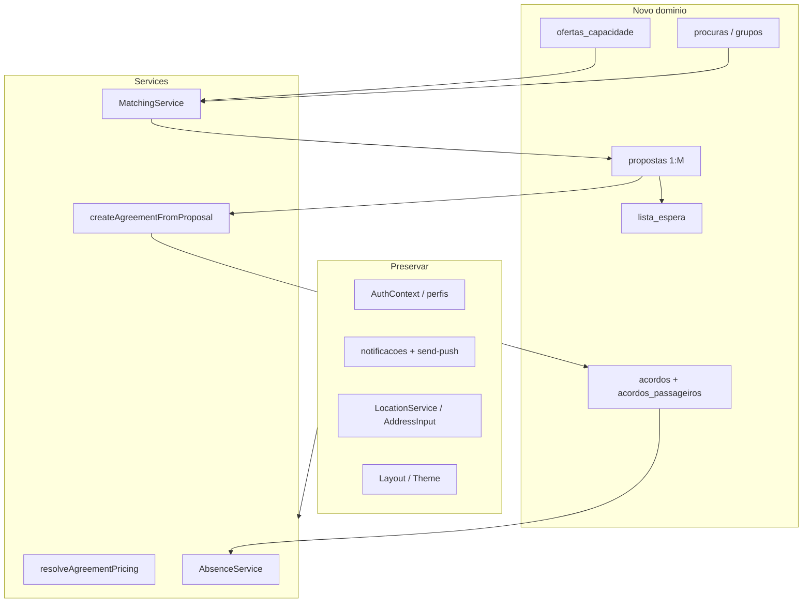
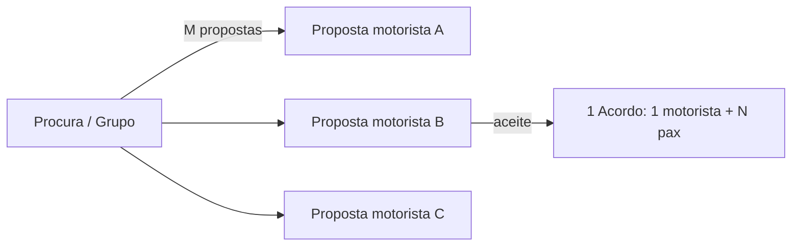
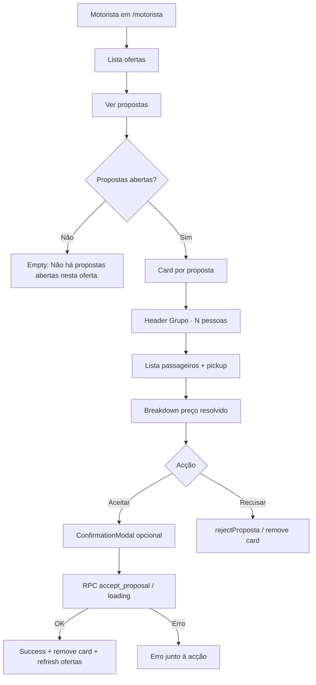

# Marketplace Oferta / Procura — Design

**Spec**: `.specs/features/marketplace-oferta-procura/spec.md`  
**Context**: `.specs/features/marketplace-oferta-procura/context.md`  
**Status**: **Approved** — UI visual = v0 (`v0-reference/`, chat `cYa4j7gxE0p`); lógica de negócio = spec/context/design/planos (prevalecem em conflito)  
**Tasks**: `.specs/features/marketplace-oferta-procura/tasks.md`

---

## Architecture Overview

Reconstrução limpa do domínio de negócio sobre a infra existente (Auth, Push, Photon, Layout). Camadas:

1. **Postgres / Supabase** — schema novo + RPC atómica `accept_proposal` + triggers faltas/notificações  
2. **Services (JS + Vitest)** — pricing, matching, ofertas, procuras, propostas, acordos 1:N, waitlist, faltas  
3. **Pages / Components** — substituir dashboards/PublishRoute/MyAgreements/Acordo*; adaptar VehicleSetup e AbsenceTracker  
4. **UI SoT** — Penpot (MCP); Superdesign só exploração; Cursor implementa + Visual QA  



**Cardinalidade de negociação (anti-1:1):**



---

## Design Workflow (Penpot-first + exploração v0)

| Fase | Responsável | Entrega | Estado |
|------|-------------|---------|--------|
| A — UX analysis | Cursor | User flows + estados | Feito |
| B — UX structure | Cursor | Inventário | Feito |
| C — Visual | **v0 (One MCP)** → consolidar no Penpot | Protótipo polished 8 vistas | **v0 feito**; Penpot reimport **pendente** (plugin desligado) |
| Gate | Humano | Aprovar visual v0 + reimport Penpot | Em revisão |
| D — Implement | Cursor | TDD → `src/` JSX alinhado a v0/Penpot | Pendente |
| E — Visual QA | Cursor | Browser vs protótipo | Pendente |

### Porquê v0 nesta iteração

Os boards Penpot iniciais eram wireframes com jargon técnico — rejeitados. Foi aplicado `design-first-ui-prompting` e gerado um protótipo no **v0** (`v0-pro`) via MCP One.

**Referência canónica actual da UI:**

- Chat: https://v0.app/chat/cYa4j7gxE0p  
- Código: `.specs/features/marketplace-oferta-procura/v0-reference/`  
- Preview: https://boleia-certa-marketplace-mobile-ui.v0.build  

**Penpot** continua a fonte de verdade do design system do projecto: assim que o plugin estiver ligado, **substituir** os boards `MKT — *` pelos padrões do v0 (copy humana, hierarquia, chips, rotas).

### Regras de copy (obrigatórias — do v0)

- «Por passageiro» / «Total do acordo»
- «3 lugares disponíveis», «Grupo · 3 pessoas», «4 ofertas compatíveis»
- «120.000 Kz», «40.000 Kz / pessoa»
- **Proibido na UI:** `N_actual`, `N_proposto`, `N_candidato`, `N_contrato`, `N_activos`, `POR_PASSAGEIRO`, `TOTAL_ACORDO`, `modo_preco`, `ask`

### Vistas v0 (screen switcher)

1. As minhas ofertas  
2. Publicar oferta  
3. A minha procura  
4. Ofertas compatíveis  
5. Lista de espera  
6. Rever proposta  
7. Acordos  
8. Detalhe do acordo  

### baseline-ui (aplicar na implementação)

- `text-balance` em títulos; `text-pretty` em body  
- Sem gradients roxos / glow  
- Um accent (`#10B748`); `h-dvh` não `h-screen`  
- Skeleton em loading; erros junto à acção  

---

## Penpot Inventory (SoT — parcialmente obsoleto)

**Ficheiro:** `Novo Ficheiro 1`  
**Estado:** tokens/cores/componentes base OK; **14 boards wireframe obsoletos** (substituir após reabrir MCP).  
**Font / frame:** Plus Jakarta Sans · 390×844  

### Cores / tokens / componentes library

Mantidos: primary `#10B748`, set `boleia`, `PrimaryButton`, `SecondaryButton`, `PageHeader`, `OfertaCard`, `ProcuraCard`, `AcordoCard` — **actualizar visual** para match v0 na reimportação.

---

## Code Reuse Analysis

### Preservar / reutilizar

| Artefacto | Location | Uso |
|-----------|----------|-----|
| Auth | `AuthContext.jsx`, `ProtectedRoute`, `Auth.jsx` | Sessão; `tipoPerfil` |
| Shell | `Layout.jsx`, Theme, `PageShell`, `PageHeader`, `EmptyState`, `LoadingSkeleton` | Shell mobile |
| Geo | `LocationService`, `useAutocomplete`, `AddressInput`, `AutocompleteDropdown` | OD / pontos membros |
| Push | `NotificationBell`, `useNotifications`, `usePushNotifications`, `sw.js`, Edge `send-push` | Novos `type`s metadata |
| Modais | `ConfirmationModal`, padrão `isOpen` + callbacks | Confirmar aceite / saída |
| Utils | `errorHandler`, `formatKwanza`, `validation`, `cn` | Erros e Kz |
| Faltas UI | `AbsenceTracker`, `LogAbsenceModal` | Adaptar a acordo 1:N |
| Veículo | `VehicleSetup`, `ProfileService.getVehicle/updateVehicle` | `capacidade_total` / `vagas_passageiros` |
| Deep link | `notificationRouter.js` | Novos types; manter `/acordos?openAcordoId=` |

### Substituir / eliminar

| Artefacto | Motivo |
|-----------|--------|
| `RouteService` / `publishRoute` | → `OfertaService` |
| `AgreementsService.requestSeat` + joins `routes` | → propostas + `createAgreementFromProposal` |
| `PassengerDashboard` / `DriverDashboard` / `PublishRoute` / `MyAgreements` | Domínio legado |
| `AcordoCard*`, `AcordoDetailsModal`, `AcordoKebabMenu` | Acoplados a `acordo.routes.*` |
| BD `routes`, RPCs seats ±1, trigger faltas `/4` | Corte limpo |

### Integration points

| Sistema | Método |
|---------|--------|
| Supabase | Migração MCP única; RLS novas tabelas; não tocar RLS perfis/push excepto refs a `routes` |
| Photon | Sem alteração; matching usa lat/lng já resolvidos |
| Sentry | Mantém-se via `main.jsx` |

---

## Data Models

Tipagem em JSDoc no código (sem TypeScript). Campos conceptuais:

### `veiculos` (ALTER)

- `capacidade_total` (int) — lugares do carro incl. motorista  
- `vagas_passageiros` = `capacidade_total - 1` — **só capacidade**, nunca preço  
- Remover ambiguidade de `lugares_disponiveis`  
- Preservar UNIQUE `id_motorista`

### `ofertas_capacidade`

- `id`, `driver_id`, `veiculo_id`
- `vagas_totais`, `vagas_disponiveis` (≥ 0)
- `modo_preco`: `POR_PASSAGEIRO` | `TOTAL_ACORDO`
- `valor_mensal_ask_kz` (int)
- `flexibilidade_rota`, OD ou zonas, horários, `dias_semana`
- `estado`: `inactiva` | `disponivel` | `parcial` | `cheia`
- coords: `origin_lat/lng`, `destination_lat/lng` (rota fixa) ou equivalentes de zona

### `procuras` / `grupos` / `membros_grupo`

- Procura âncora; grupo opcional = **procura colectiva viva**
- `N_actual` = COUNT membros activos (coluna `n_candidato` em sync)
- `n_maximo` = capacidade pretendida pelo criador (grupo continua aberto e negociável enquanto `N_actual < n_maximo`)
- Pontos preferenciais por membro; OD/horários/dias na procura
- **Sem** preço próprio obrigatório no grupo — preço na oferta/proposta do motorista
- Descoberta pública + pedido de entrada (telefone = fallback transitório)

### `propostas`

- `oferta_id`, `procura_id` e/ou `grupo_id`
- `modo_preco`, `valor_mensal_ask_kz`, `n_passageiros_propostos` (= **`N_proposto`** snapshot de `N_actual` no instante da criação — **não** mutar se o grupo crescer)
- `estado`: `aberta` | `aceite` | `rejeitada` | `invalidada` | `cancelada`
- Uma procura pode ter **M** propostas abertas
- Entrada de membro **não** invalida propostas abertas; renegociação com outro N = **nova** proposta
- Aceitação: incluir primeiros `N_proposto` membros por `ordem_insercao` se `N_actual > N_proposto`

### `acordos` + `acordos_passageiros`

**Cabeçalho:** `oferta_id`, `procura_id`/`grupo_id`, `driver_id`, `modo_preco`, `n_passageiros_contrato`, `valor_mensal_total_kz`, `valor_mensal_por_passageiro_kz` (= `base` no TOTAL), `dias_uteis_mes`, cláusulas contrato, `estado`  
**Sem** `passenger_id` no cabeçalho.

**Linhas:** `acordo_id`, `passenger_id`, `quota_mensal_kz`, pontos acordados, `estado` (`activo` | `saiu` | …), `ordem_insercao` (0…N-1) para regra de resto

### `lista_espera`

- `oferta_id` + procura/grupo; não consome vaga; promoção = notificação

### `faltas`

- `acordo_id`, opcional `passenger_id`, `viagem`, `desconto_kz` via trigger lendo cabeçalho congelado / `dias_uteis_mes`

---

## Pricing Algorithm (MKT-04)

```js
/**
 * @param {{ modo_preco: 'POR_PASSAGEIRO'|'TOTAL_ACORDO', valor_ask_kz: number, n_passageiros: number }} input
 * @returns {{
 *   valor_mensal_total_kz: number,
 *   valor_mensal_por_passageiro_kz: number,
 *   quotas: number[]  // length N; sum === total
 * }}
 */
```

**POR_PASSAGEIRO:**  
`individual = valor_ask_kz`; `total = individual * N`; `quotas = Array(N).fill(individual)`.

**TOTAL_ACORDO:**  
`T = valor_ask_kz`; `base = Math.floor(T / N)`; `resto = T % N`;  
`quotas[i] = i < resto ? base + 1 : base` (i = ordem de inserção);  
cabeçalho `valor_mensal_por_passageiro_kz = base`; `valor_mensal_total_kz = T`.

Testes obrigatórios: 120000/4; 100000/3; 100001/3; N=1; rejeitar N&lt;1.

---

## Matching MVP (MKT-09)

Constantes (`src/utils/matchingConfig.js` ou similar):

| Parâmetro | Default | Notas |
|-----------|---------|-------|
| `MATCH_TIME_TOLERANCE_MINUTES` | `15` | ± minutos |
| `MATCH_RADIUS_ORIGIN_METERS` | `2500` | haversine; Luanda casa–trabalho |
| `MATCH_RADIUS_DESTINATION_METERS` | `2500` | configurável à parte |

Regras (todas AND para aceite directo):

1. `|hora_oferta - hora_procura| ≤ tolerância` (mesmo dia-da-semana relevante)  
2. distância origem ≤ raio origem  
3. distância destino ≤ raio destino  
4. `N_actual ≤ vagas_disponiveis`

Se 1–3 ok mas 4 falha → elegível waitlist.  
**Fora do MVP:** OSRM, Google Directions, ETA, path snapping.

Haversine: novo helper puro em `src/utils/geo.js` (TDD) — não depende de Photon.

---

## Components & Services

### `resolveAgreementPricing` — `src/utils/resolveAgreementPricing.js` (ou services)

- **Purpose:** Resolver totais/quotas na aceitação/negociação  
- **Reuses:** nada legado; testes dedicados  

### `MatchingService` — `src/services/MatchingService.js`

- `findCompatibleOfertas(procura|grupo)` → lista filtrada  
- Depende: ofertas activas, `matchingConfig`, `geo`  

### `OfertaService` — `src/services/OfertaService.js`

- CRUD oferta; deriva `vagas_totais` do veículo; estados `disponivel|parcial|cheia`  

### `ProcuraService` / `GrupoService`

- Criar procura; gerir membros; sync `N_actual`; **não** invalidar propostas abertas só porque `N_actual` mudou  

### `PropostaService`

- Criar proposta (motorista→procura ou inverso conforme fluxo UI Penpot)  
- Listar M propostas por procura  

### `AgreementService` (substitui canónico de `requestSeat`)

- `createAgreementFromProposal(propostaId)` → chama RPC `accept_proposal`  
- `leavePassenger(acordoId, passengerId)` → vagas; **assert** preços intactos  
- `renegotiateAgreementPricing` (P2)  
- Agent discretion: ao aceitar, **cancelar** outras propostas `aberta` da mesma procura/grupo  

### `WaitlistService`

- `enqueue`, `notifyOnVacancy` (só notificação)  

### `AbsenceService` (adaptar)

- Trigger BD: `desconto = valor_mensal_por_passageiro_kz / dias_uteis_mes`  
- Remover qualquer `/ 4`  

### UI pages (gate Penpot — telas em `01 — Marketplace`)

| Path | Board Penpot | Substitui |
|------|--------------|-----------|
| `/publicar-trajeto` | MKT — Publicar Oferta | `PublishRoute` |
| `/motorista` | MKT — Motorista Hub (+ Aceitar Proposta) | `DriverDashboard` |
| `/passageiro` | MKT — Passageiro Hub / Matches / Waitlist / Empty | `PassengerDashboard` |
| `/acordos` | MKT — Acordos / Acordo Detalhe | `MyAgreements` |
| `/veiculo` | MKT — Veículo | adaptar `VehicleSetup` |
| `/faltas` | MKT — Faltas / Falta Registo | adaptar `AbsenceTracker` |

Reutilizar no código: `PageShell`, `PageHeader`, `EstadoBadge`, `ConfirmationModal`, `AddressInput`, `EmptyState`, `LoadingSkeleton`. Novos só se o Penpot exigir variante sem equivalente.

---

## RPC `accept_proposal` (atómica)

1. `SELECT … FOR UPDATE` na oferta  
2. Recalcular `vagas_ocupadas` / `vagas_disponiveis`  
3. Se `n_passageiros_propostos > vagas_disponiveis` → erro / waitlist (não insert parcial)  
4. Resolver pricing (`resolveAgreementPricing` espelhado em SQL ou valores já na proposta)  
5. INSERT acordo + N `acordos_passageiros` com `quota_mensal_kz` e `ordem_insercao`  
6. UPDATE `vagas_disponiveis`; estado oferta `parcial`/`cheia`  
7. Marcar proposta `aceite`; cancelar outras abertas da mesma procura (discretion)  
8. Trigger notificações (N passageiros + motorista) via pipeline push existente  

---

## Migration Strategy (corte limpo)

Ordem sugerida (uma migração ou sequência MCP sem dual-write):

1. TRUNCATE/DROP dependentes: `faltas` → `acordos` → `routes`  
2. DROP RPCs seats, funções/triggers legados (`handle_falta_desconto` com `/4`, notif antiga `route_id`)  
3. ALTER `veiculos`  
4. CREATE tabelas novas + índices + RLS  
5. CREATE RPC `accept_proposal` + triggers faltas/notif  
6. Verificação: `handle_new_user` / RLS perfis / push intactos  

Preservar checklist do plano de impacto (não apagar auth/push/VAPID).

---

## User Flows & States (fase A — pré-Penpot)

### Motorista — publicar oferta

Estados: form vazio → validação coords → loading → sucesso / erro RLS|rede.  
Negócio: sem veículo / vagas_passageiros &lt; 1 → bloquear.

### Passageiro — procura + match

Estados: sem procura → criar → lista matches (vazio compatível) → proposta / waitlist.  
Negócio: `N_candidato > vagas` → CTA waitlist.

### Aceitar proposta

Estados: revisão N pontos → confirmar → loading RPC → acordo criado / overbooking / erro.  

### Acordo activo — saída / faltas

Estados: lista N pax → sair (confirm) → quotas intactas; registar falta → desconto referência `base`.

---

## Error Handling

| Cenário | Handling | UI |
|---------|----------|-----|
| Overbooking RPC | throw mensagem PT | feedback local / notification |
| Proposta invalidada (N mudou) | throw | pedir nova proposta |
| Offline / RLS | `getFriendlyErrorMessage` | erro amigável |
| Geo Photon falha | `LocationService` devolve `[]` | empty autocomplete |

---

## Tech Decisions

| Decision | Choice | Rationale |
|----------|--------|-----------|
| Arredondamento | Resto em `ordem_insercao` | Spec: soma exacta = T |
| Raio default | 2500 m OD | Discretion; Luanda; configurável |
| Ao aceitar proposta | Cancelar outras abertas da mesma procura | Evita dois acordos para a mesma procura |
| Pricing puro JS + espelho SQL na RPC | Testável no Vitest; BD garante atomicidade | TDD Akita |
| Matching sem routing | Haversine + tempo | Spec MVP |
| UI | Penpot gate | AGENTS.md |
| Sem TypeScript | JSDoc | `.cursorrules` |

---

## Requirement → Design mapping

| ID | Design coverage |
|----|-----------------|
| MKT-01 | OfertaService + schema ofertas + UI pós-Penpot |
| MKT-02 | Procura/Grupo services + schema |
| MKT-03 / MKT-18 | RPC accept + Proposta 1:M |
| MKT-04 | resolveAgreementPricing + resto |
| MKT-05 | leavePassenger asserts |
| MKT-06 | fórmula vagas + RPC |
| MKT-07 | trigger faltas |
| MKT-08 | WaitlistService |
| MKT-09 | MatchingService + matchingConfig |
| MKT-10 / 11 / 12 | migração + RLS + notif |
| MKT-13 | renegotiate P2 |
| MKT-14 | App.jsx + notificationRouter |
| MKT-15 | mapa N pontos P3 |
| MKT-16 | AGENTS.md pós-schema |
| MKT-17 | três Ns em todo o código/docs |

---

## Open before Tasks

1. **Tu:** abrir https://v0.app/chat/cYa4j7gxE0p e validar as 8 vistas (aprovar ou pedir ajustes).  
2. **Reabrir Penpot MCP** → reimportar boards a partir do v0 (descartar wireframes com jargon).  
3. Aprovar Design → `tasks.md` (MKT-*).

---

## T24 — Hub motorista: rever proposta multi-passageiro

**Task:** T24 (MKT-03) · **Gate design:** Ready for Implementer  
**Path UI:** `/motorista` → `DriverDashboard.jsx` secção «Rever propostas»  
**Accept path (já existe):** `createAgreementFromProposal` → RPC `accept_proposal`

### Gap actual (código)

O hub lista ofertas e propostas abertas com contagem + ask + Aceitar/Recusar. **Falta:** lista de passageiros cobertos pelo snapshot, pontos de pickup, e **preço resolvido** via `resolveAgreementPricing` (preview), com copy humana.

### User flow



1. Motorista abre oferta → «Ver propostas».  
2. Para cada proposta `aberta`: vê composição do snapshot (`n_passageiros_propostos`) — primeiros N membros por `ordem_insercao` (grupo vivo; **nunca** «grupo incompleto»).  
3. Vê preço resolvido (labels humanas + Kz).  
4. Aceitar → RPC atómica (já wired); Recusar → `rejectProposta`.

### Estados UI

| Estado | UI |
|--------|-----|
| **Empty** (sem propostas na oferta) | Texto: «Não há propostas abertas nesta oferta.» — sem CTA extra (já tem «Publicar oferta» no header) |
| **Loading** (lista ofertas / propostas / membros) | `LoadingSkeleton` estrutural (baseline-ui); botões Aceitar/Recusar `disabled` + `busyId` |
| **Error** | Banner/`role="alert"` junto à secção de acção (`getFriendlyErrorMessage` / mensagem RPC PT) |
| **Success** (aceite) | «Proposta aceite. Acordo criado.» (emerald); card removido; ofertas refresh (vagas) |
| **Busy** (aceitar/recusar) | Ambos CTAs disabled no card activo; sem double-submit |
| **Confirmação** (recomendado) | `ConfirmationModal` antes de Aceitar (acção irreversível — baseline-ui AlertDialog) |

### Composição do card (ordem visual)

1. **Cabeçalho:** chip «Nova» (opcional) + título humano  
   - Grupo: «Grupo · 2 pessoas»  
   - Procura solo: «1 passageiro» / «2 passageiros»  
2. **Lista passageiros** (snapshot): avatar iniciais · nome · pickup opcional (`MapPin` + texto curto)  
3. **Separator**  
4. **Preço resolvido** (ver regras abaixo)  
5. **CTAs:** primary «Aceitar proposta» · secondary «Recusar»

### Regras de display de preço (`resolveAgreementPricing`)

Preview client-side antes do RPC (não muta BD):

```js
resolveAgreementPricing({
  modo_preco: proposta.modo_preco,       // interno; UI não mostra o enum
  valor_ask_kz: proposta.valor_mensal_ask_kz,
  n_passageiros: proposta.n_passageiros_propostos,
})
```

| Modo interno | Labels UI | O que mostrar |
|--------------|-----------|---------------|
| `POR_PASSAGEIRO` | «Por passageiro» | Ask / pessoa · Total = ask × N (`valor_mensal_total_kz`) |
| `TOTAL_ACORDO` | «Total do acordo» | Total = ask · «Por passageiro» ≈ `valor_mensal_por_passageiro_kz` (base) · se `T % N ≠ 0`, nota humana: primeiros passageiros (por ordem) pagam +1 Kz para fechar o total exacto; opcionalmente listar `quotas[i]` por linha |

- Sempre **Kz** + `tabular-nums` + `formatKwanza`.  
- **Proibido na UI:** `N_actual`, `N_proposto`, `N_candidato`, `POR_PASSAGEIRO`, `TOTAL_ACORDO`, `modo_preco`, `ask`.

### Copy samples (PT-PT)

- «Rever propostas»  
- «Grupo · 3 pessoas»  
- «Ponto de encontro: Talatona, perto do Condo»  
- «Total do acordo» → «120.000 Kz»  
- «Por passageiro» → «40.000 Kz / pessoa»  
- «Alguns passageiros pagam 33.334 Kz e outros 33.333 Kz para o total fechar exacto.» (só se resto ≠ 0)  
- «Aceitar proposta» / «Recusar»  
- «Proposta aceite. Acordo criado.»  
- «Não há propostas abertas nesta oferta.»

### Componentes

| Peça | Fonte | Notas |
|------|-------|-------|
| Shell / header / empty / skeleton | `PageShell`, `PageHeader`, `EmptyState`, `LoadingSkeleton` | Já no hub |
| Card content | Tailwind section actual **ou** `@shadcn/card` | Preferir tokens existentes; add se necessário |
| CTAs | `src/components/ui/button.jsx` (já) | `default` / `secondary` |
| Chip estado | Badge shadcn **ou** chip Tailwind actual | `npx shadcn@latest add @shadcn/badge` |
| Lista pax | Avatar shadcn (opcional) + Lucide `MapPin` | `npx shadcn@latest add @shadcn/avatar` |
| Separador preço | `@shadcn/separator` (opcional) | `npx shadcn@latest add @shadcn/separator` |
| Confirmar aceite | `ConfirmationModal` | Já no repo |
| Pricing | `resolveAgreementPricing` + `formatKwanza` | Preview only |
| Dados membros | `listMembrosGrupo` (+ slice primeiros N) | Via `grupo_id` da proposta |

**shadcn add (se faltar no repo):**  
`npx shadcn@latest add @shadcn/card @shadcn/badge @shadcn/separator @shadcn/avatar`  
Hoje só `button` existe em `src/components/ui/` — reutilizar padrões Tailwind do hub se o Implementer preferir não instalar todos.

### Dados / composição snapshot

- `proposta.n_passageiros_propostos` = N do contrato previsto.  
- Membros: `listMembrosGrupo(grupo_id)` ordenados por `ordem_insercao` → **slice(0, N)**.  
- Se `N_actual > N` (grupo cresceu): mostrar só os N cobertos; copy neutra (ex. «Passageiros neste acordo») — **nunca** «grupo incompleto».  
- Se `N_actual < N` na revisão: ainda mostrar aviso suave de que a aceitação pode falhar (RPC) — sem jargon.

### Referências de design

| Fonte | Resultado |
|-------|-----------|
| **UI Skills** | `ibelick/baseline-ui` — `text-balance`/`text-pretty`, skeletons, erro junto à acção, AlertDialog p/ irreversível, `tabular-nums`, um accent `#10b748`, sem glow/purple |
| **Mobbin** | **Falhou** (plano free / paid required) — degradado; não bloqueia |
| **v0 marketplace (canónico)** | Chat https://v0.app/chat/cYa4j7gxE0p · vista **6. Rever proposta** · código `.specs/features/marketplace-oferta-procura/v0-reference/` |
| **v0 T24 (refino multi-pax)** | Chat https://v0.app/chat/tLT9dcf4coN · Create async (`v0-pro`, msg `cFoHsCeYHPwNQd530OBim4QcPJNq8NDK`) — briefing multi-pax + pickup + pricing; geração pode ainda estar a correr; **SoT visual imediato** = vista 6 de `cYa4j7gxE0p` + esta secção. **Sem** deploy Vercel |
| **shadcn** | Button (local) · Card/Badge/Separator/Avatar (@shadcn registry) |

### Implementer checklist (após este gate)

1. TDD: testes do card/secção com lista membros + preview pricing (incl. TOTAL resto).  
2. Estender `DriverDashboard` (ou extrair `PropostaReviewCard.jsx`) sem reinventar Accept RPC.  
3. Copy humana only; mapear enums só no código.  
4. Visual QA vs v0 `cYa4j7gxE0p` + chat T24 `tLT9dcf4coN`.
