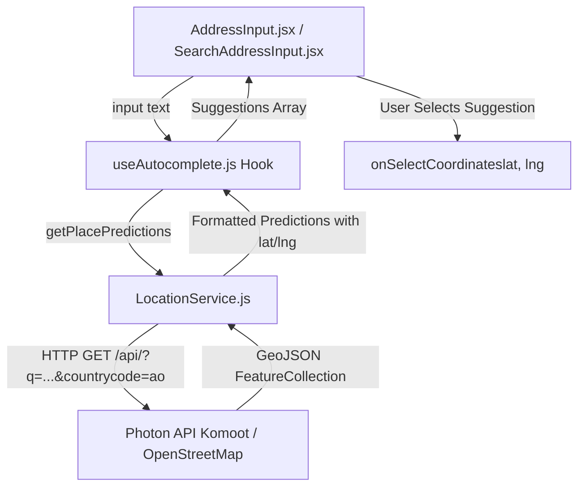

# OpenStreetMap (OSM) Geocoding Migration Technical Design

**Spec**: `.specs/features/osm-geocoding-migration/spec.md`  
**Status**: Approved  

---

## Architecture Overview

A migração substitui o driver do Google Maps pelo driver do OpenStreetMap (via Photon API / Nominatim), isolando a lógica de geolocalização no serviço `LocationService.js`.



---

## Code Reuse Analysis

### Existing Components to Leverage

| Component | Location | How to Use |
| --------- | -------- | ---------- |
| `useAutocomplete.js` | `src/hooks/useAutocomplete.js` | Mantido com a mesma interface pública; apenas redireciona chamadas para `LocationService.js`. |
| `AddressInput.jsx` | `src/components/AddressInput.jsx` | Consome `useAutocomplete.js` sem alterações na lógica de renderização. |
| `SearchAddressInput.jsx` | `src/components/SearchAddressInput.jsx` | Consome `useAutocomplete.js` sem alterações. |
| `AutocompleteDropdown.jsx` | `src/components/AutocompleteDropdown.jsx` | Atualização visual mínima no texto do rodapé. |

---

## Components & Interfaces

### 1. `LocationService.js` (Novo Serviço)

- **Purpose**: Prover serviços de busca de lugares (autocomplete) e geocoding reverso/direto usando a API Photon do OpenStreetMap.
- **Location**: `src/services/LocationService.js`
- **Interfaces**:
  ```javascript
  export const getPlacePredictions = async (input: string): Promise<Array<{
    place_id: string,
    description: string,
    lat: number,
    lng: number
  }>>
  
  export const getPlaceDetails = async (placeId: string, cachedSuggestions?: Array<any>): Promise<{
    lat: number,
    lng: number
  }>
  ```
- **Dependencies**: Native `fetch` API.
- **API Endpoint**: `https://photon.komoot.io/api/?q={query}&countrycode=ao&limit=5`

---

## Data Models

### Photon API Response (GeoJSON Feature) Format
```json
{
  "type": "FeatureCollection",
  "features": [
    {
      "geometry": {
        "coordinates": [13.234, -8.838], // [longitude, latitude]
        "type": "Point"
      },
      "properties": {
        "osm_id": 123456,
        "name": "Talatona",
        "city": "Luanda",
        "country": "Angola",
        "street": "Avenida Samora Machel"
      }
    }
  ]
}
```

### Internal Boleia Certa Prediction Object Format
```javascript
{
  place_id: "osm-123456",
  description: "Talatona, Luanda, Angola",
  lat: -8.838,
  lng: 13.234
}
```

---

## Error Handling Strategy

| Error Scenario | Handling | User Impact |
| -------------- | -------- | ----------- |
| Erro de Rede / Offline | Retorna array vazio e define mensagem de erro no hook. | Exibe aviso suave no dropdown sem crashar a página. |
| Resposta Sem Resultados | Retorna `[]`. | Dropdown fecha suavemente. |
| Input < 3 caracteres | Retorna `[]` imediatamente sem fazer HTTP fetch. | Nenhuma requisição desnecessária. |

---

## Tech Decisions

| Decision | Choice | Rationale |
| -------- | ------ | --------- |
| Provedor Geocoding | Photon API (OSM) | 100% Gratuito, sem API key, retorna lat/lng direto na previsão, excelente indexação de typeahead. |
| Manutenção do `getPlaceDetails` | Retornar coordenadas já armazenadas no objeto de previsão | Evita requisições extras; o Photon já entrega a geometria no autocomplete. |
| Compatibilidade de Mocks | Substituir `GoogleMapsService` nos arquivos de teste por `LocationService` | Mantém os testes de página ([PublishRoute.test.jsx](file:///c:/boleia-certa/src/pages/PublishRoute.test.jsx) e [PassengerDashboard.test.jsx](file:///c:/boleia-certa/src/pages/PassengerDashboard.test.jsx)) verdes e concisos. |
